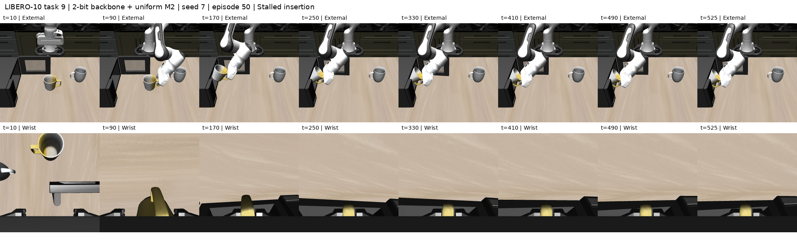
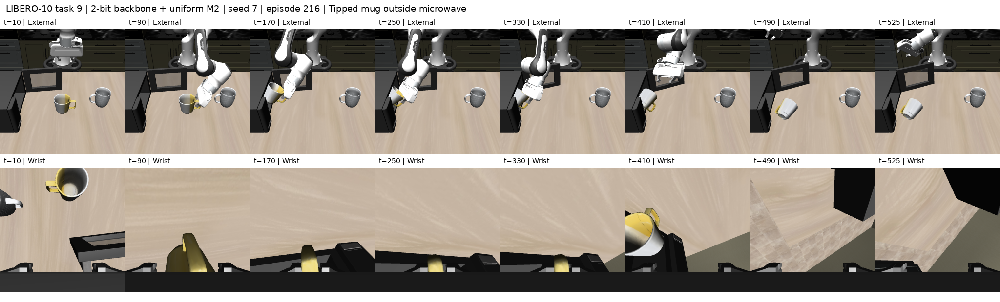
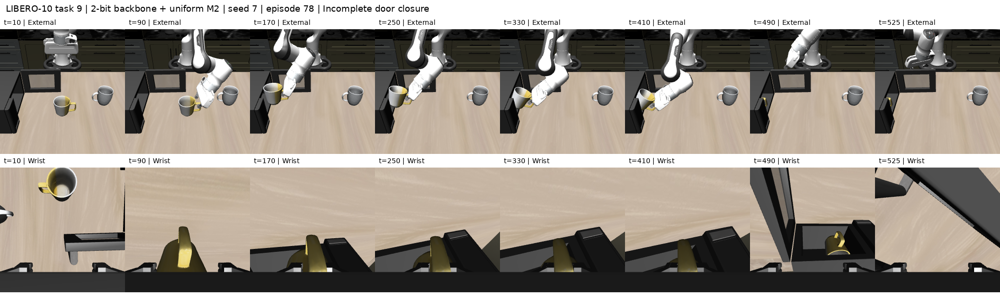
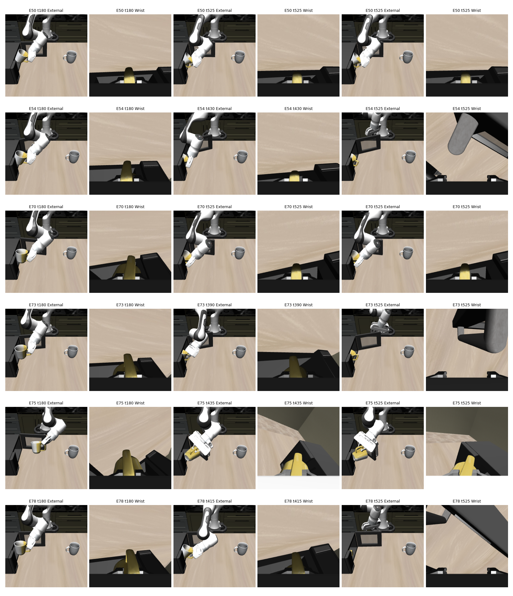
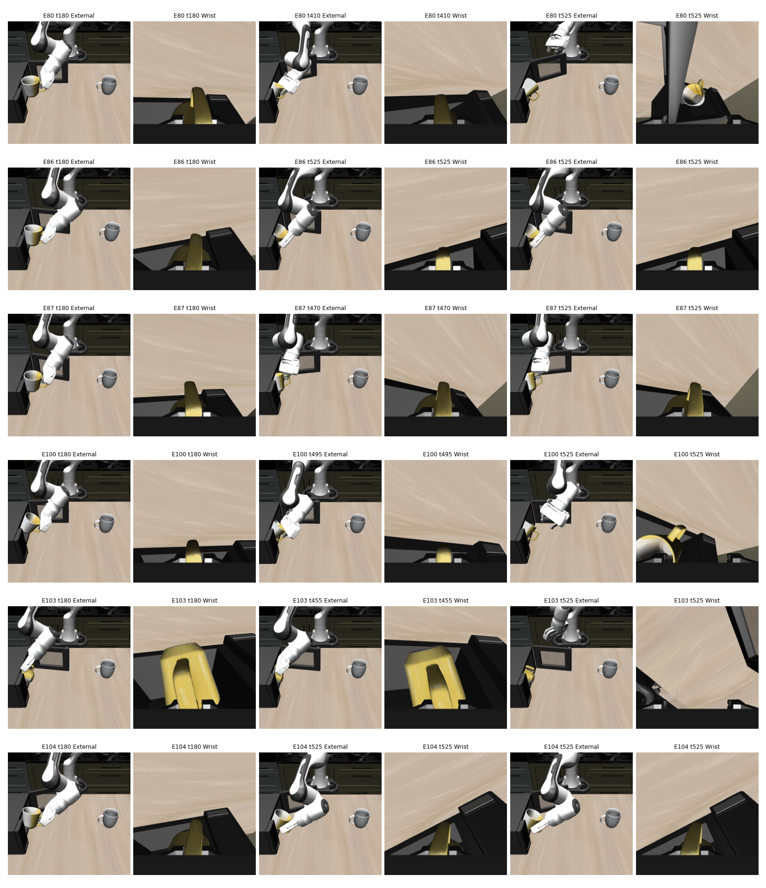
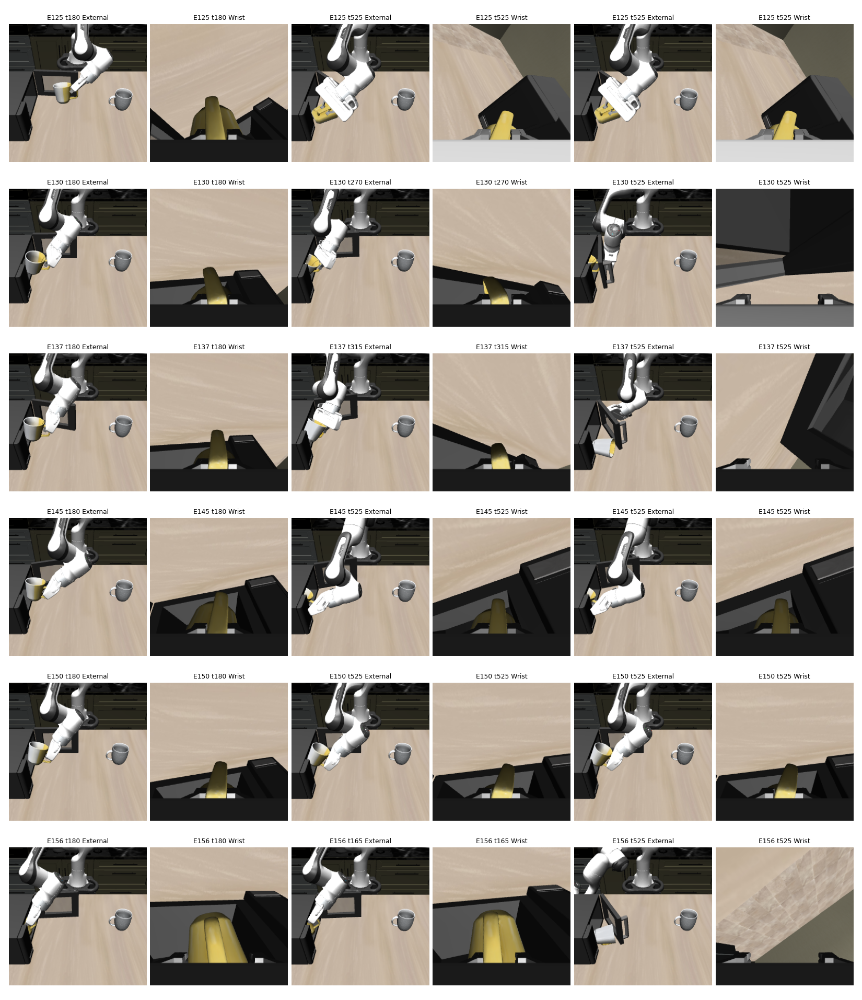
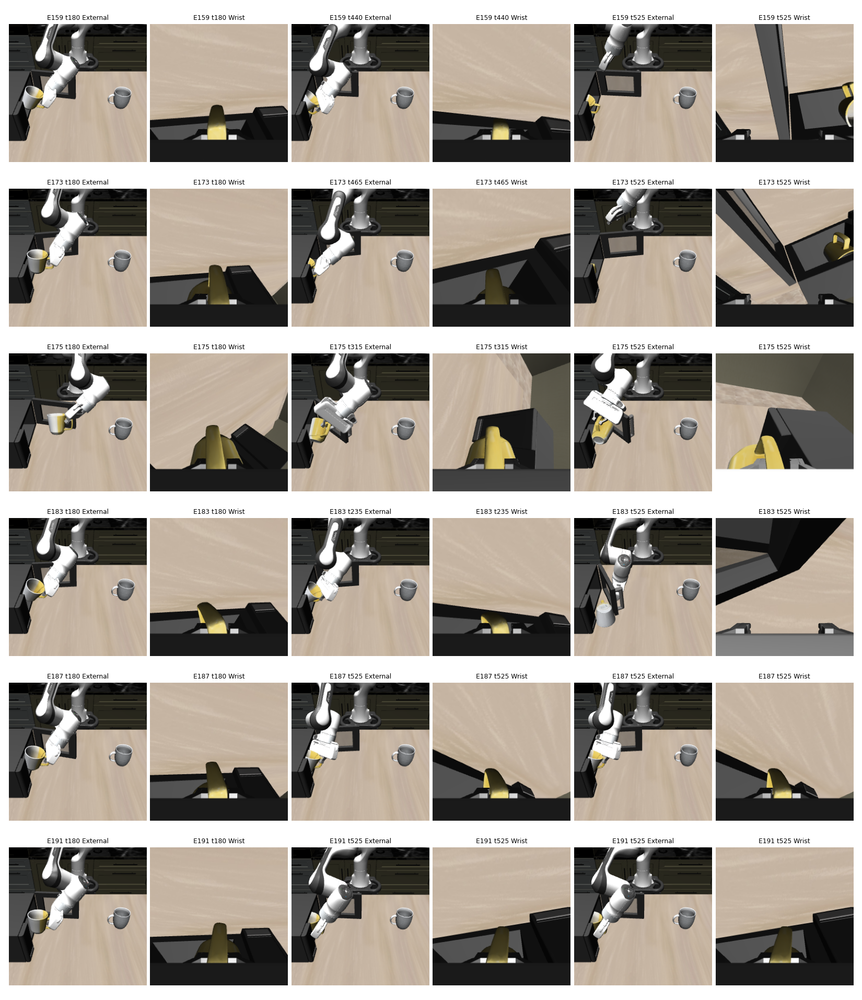
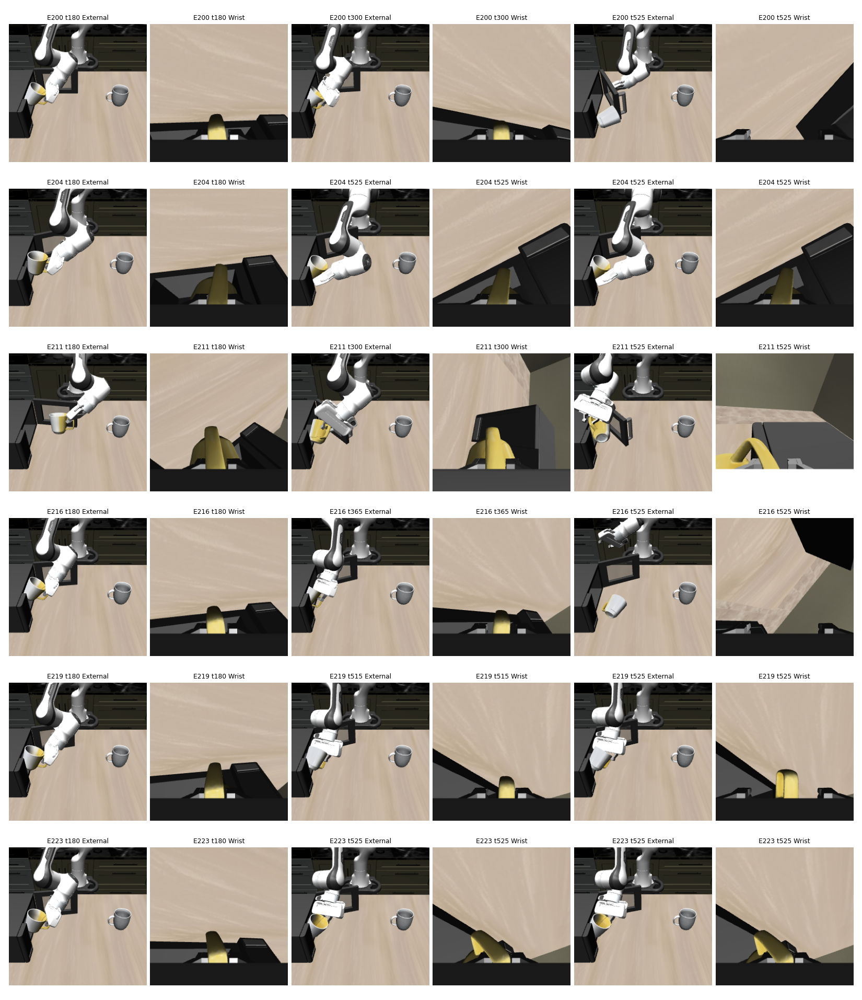
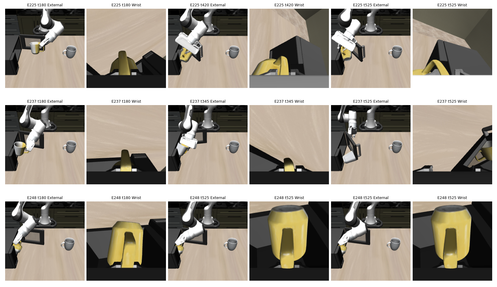

# H4：2-bit 模型 task 9 失败图集

模型：2-bit backbone＋uniform M2 expert（`bb_M2_ae_M2_fp32`）。任务：将白黄杯放入微波炉并关门。灰色瓷杯是干扰物。

协议：LIBERO-10 task 9，seed 7，回合 IDs 50–249，共200例；50个官方初始状态各重复4次，状态索引为 episode % 50。成功167/200，以下涵盖全部33个失败。

| 描述性分类 | 例数 | 占33个失败 |
|---|---:|---:|
| 停滞超时 | 12 | 36.4% |
| 碰撞／倾倒 | 6 | 18.2% |
| 其他／原因仍有歧义 | 15 | 45.5% |
| 错误物体／顺序 | 0 | 0% |
| 明确抓持滑脱 | 0 | 0% |

**解释边界：**这是单名非盲代理的描述性标注，不是独立人工双人编码，也不直接测量内部决策。检查使用双视角关键帧和完整状态序列摘要；未做逐帧人工视频编码。所有33例都未检测到夹持灰色干扰杯，其位移小于1微米。“0例错误物体／顺序”仅指没有足够证据归入该类；不证明不存在顺序错误。

“停滞”指正确抓取等前期进展后，后续放置／关门长期未推进，不是全程完全不动。“碰撞／倾倒”描述看见的倾倒结果，不区分主动松手、滑脱和接触导致的原因；有歧义者保留在其他类。

图中 `E` 是回合编号；`t` 是模拟器控制步，含最初10步稳定过程。原始轨迹每5步保存一次双视角图像；末帧通常为 t=525，终止状态为 t=530。下列动画以8帧/秒播放（原20 Hz控制、每5步采样，因此为2倍速）。图像来自实际保存的渲染帧，未生成或改变场景内容。

## 三个代表案例

### 回合 50（初始状态 0）

停滞超时：正确杯子到达微波炉口后持续停滞，最终仍被夹持，门未关闭。

[查看完整双视角动画](figures/h4_task9_episode50.gif) · [打开原尺寸时间序列](figures/h4_task9_episode50.png)

### 回合 216（初始状态 16）

碰撞／倾倒：杯子在微波炉口失去稳定抓持或被释放，最终侧倒在外侧桌面。此分类描述可见结果，不证明是滑脱还是主动释放。

[查看完整双视角动画](figures/h4_task9_episode216.gif) · [打开原尺寸时间序列](figures/h4_task9_episode216.png)

### 回合 78（初始状态 28）

其他：杯子达到包含判据，但门未关闭；现有证据不足以唯一归因为动作顺序错误。

[查看完整双视角动画](figures/h4_task9_episode78.gif) · [打开原尺寸时间序列](figures/h4_task9_episode78.png)

## 全部33个失败

每行一个回合；每组两列分别为外部相机和腕部相机。三个取样时点为约 t=180、最后一次检测到抓持附近、以及最后保存帧。若抓持持续到结束，后两组可能相同；这不是额外的独立证据。

### 图组 1：回合 50, 54, 70, 73, 75, 78

| 回合 | 初始状态 | 分类 | 最后抓持步 | 杯在微波炉内／门关闭 | 判定依据 |
|---:|---:|---|---:|---|---|
| 50 | 0 | 停滞超时 | 530 | 是／否 | 抓到正确杯子后，放置在炉口停滞；夹持持续到终止，门仍开着。 |
| 54 | 4 | 其他 | 428 | 是／否 | 满足包含判据但未关门；释放和关门阶段的具体原因有歧义。 |
| 70 | 20 | 停滞超时 | 530 | 是／否 | 抓到正确杯子后，放置在炉口停滞；夹持持续到终止，门仍开着。 |
| 73 | 23 | 其他 | 386 | 是／否 | 满足包含判据但未关门；释放和关门阶段的具体原因有歧义。 |
| 75 | 25 | 其他 | 431 | 否／否 | 杯子在炉口附近倾斜／受阻，放置与关门未完成；接触、松手和滑脱难以唯一分辨。 |
| 78 | 28 | 其他 | 415 | 是／否 | 满足包含判据但未关门；释放和关门阶段的具体原因有歧义。 |

### 图组 2：回合 80, 86, 87, 100, 103, 104

| 回合 | 初始状态 | 分类 | 最后抓持步 | 杯在微波炉内／门关闭 | 判定依据 |
|---:|---:|---|---:|---|---|
| 80 | 30 | 其他 | 407 | 是／否 | 满足包含判据但未关门；释放和关门阶段的具体原因有歧义。 |
| 86 | 36 | 停滞超时 | 530 | 是／否 | 抓到正确杯子后，放置在炉口停滞；夹持持续到终止，门仍开着。 |
| 87 | 37 | 其他 | 470 | 否／否 | 杯子在炉口附近倾斜／受阻，放置与关门未完成；接触、松手和滑脱难以唯一分辨。 |
| 100 | 0 | 其他 | 493 | 是／否 | 满足包含判据但未关门；释放和关门阶段的具体原因有歧义。 |
| 103 | 3 | 其他 | 451 | 否／否 | 杯子在炉口附近倾斜／受阻，放置与关门未完成；接触、松手和滑脱难以唯一分辨。 |
| 104 | 4 | 停滞超时 | 530 | 否／否 | 抓到正确杯子后，放置在炉口停滞；夹持持续到终止，门仍开着。 |

### 图组 3：回合 125, 130, 137, 145, 150, 156

| 回合 | 初始状态 | 分类 | 最后抓持步 | 杯在微波炉内／门关闭 | 判定依据 |
|---:|---:|---|---:|---|---|
| 125 | 25 | 停滞超时 | 530 | 否／否 | 抓到正确杯子后，放置在炉口停滞；夹持持续到终止，门仍开着。 |
| 130 | 30 | 其他 | 268 | 是／否 | 满足包含判据但未关门；释放和关门阶段的具体原因有歧义。 |
| 137 | 37 | 碰撞／倾倒 | 314 | 否／否 | 杯子最终侧倒／翻倒在微波炉外；这里只确定可见倾倒，不确定内部意图。 |
| 145 | 45 | 停滞超时 | 530 | 是／否 | 抓到正确杯子后，放置在炉口停滞；夹持持续到终止，门仍开着。 |
| 150 | 0 | 停滞超时 | 530 | 否／否 | 抓到正确杯子后，放置在炉口停滞；夹持持续到终止，门仍开着。 |
| 156 | 6 | 碰撞／倾倒 | 162 | 否／否 | 杯子最终侧倒／翻倒在微波炉外；这里只确定可见倾倒，不确定内部意图。 |

### 图组 4：回合 159, 173, 175, 183, 187, 191

| 回合 | 初始状态 | 分类 | 最后抓持步 | 杯在微波炉内／门关闭 | 判定依据 |
|---:|---:|---|---:|---|---|
| 159 | 9 | 其他 | 438 | 是／否 | 满足包含判据但未关门；释放和关门阶段的具体原因有歧义。 |
| 173 | 23 | 其他 | 462 | 是／否 | 满足包含判据但未关门；释放和关门阶段的具体原因有歧义。 |
| 175 | 25 | 其他 | 312 | 否／否 | 杯子在炉口附近倾斜／受阻，放置与关门未完成；接触、松手和滑脱难以唯一分辨。 |
| 183 | 33 | 碰撞／倾倒 | 235 | 否／否 | 杯子最终侧倒／翻倒在微波炉外；这里只确定可见倾倒，不确定内部意图。 |
| 187 | 37 | 停滞超时 | 530 | 是／否 | 抓到正确杯子后，放置在炉口停滞；夹持持续到终止，门仍开着。 |
| 191 | 41 | 停滞超时 | 530 | 是／否 | 抓到正确杯子后，放置在炉口停滞；夹持持续到终止，门仍开着。 |

### 图组 5：回合 200, 204, 211, 216, 219, 223

| 回合 | 初始状态 | 分类 | 最后抓持步 | 杯在微波炉内／门关闭 | 判定依据 |
|---:|---:|---|---:|---|---|
| 200 | 0 | 碰撞／倾倒 | 296 | 否／否 | 杯子最终侧倒／翻倒在微波炉外；这里只确定可见倾倒，不确定内部意图。 |
| 204 | 4 | 停滞超时 | 530 | 是／否 | 抓到正确杯子后，放置在炉口停滞；夹持持续到终止，门仍开着。 |
| 211 | 11 | 其他 | 298 | 否／否 | 杯子在炉口附近倾斜／受阻，放置与关门未完成；接触、松手和滑脱难以唯一分辨。 |
| 216 | 16 | 碰撞／倾倒 | 361 | 否／否 | 杯子最终侧倒／翻倒在微波炉外；这里只确定可见倾倒，不确定内部意图。 |
| 219 | 19 | 其他 | 511 | 否／否 | 杯子在炉口附近倾斜／受阻，放置与关门未完成；接触、松手和滑脱难以唯一分辨。 |
| 223 | 23 | 停滞超时 | 530 | 否／否 | 抓到正确杯子后，放置在炉口停滞；夹持持续到终止，门仍开着。 |

### 图组 6：回合 225, 237, 248

| 回合 | 初始状态 | 分类 | 最后抓持步 | 杯在微波炉内／门关闭 | 判定依据 |
|---:|---:|---|---:|---|---|
| 225 | 25 | 其他 | 417 | 否／否 | 杯子在炉口附近倾斜／受阻，放置与关门未完成；接触、松手和滑脱难以唯一分辨。 |
| 237 | 37 | 碰撞／倾倒 | 343 | 否／否 | 杯子最终侧倒／翻倒在微波炉外；这里只确定可见倾倒，不确定内部意图。 |
| 248 | 48 | 停滞超时 | 530 | 否／否 | 抓到正确杯子后，放置在炉口停滞；夹持持续到终止，门仍开着。 |

## FP task 8 的状态

新的完整200例重跑尚未完成，暂不提供最终失败原因分布。旧的失败专用诊断回放仅复现了88个历史失败中的49个，另外39个回放成功，因此旧诊断图不能替代完整重跑，也不能据此计算新的FP成功率。

[全部标注及轨迹校验值](results/h4_task9_gallery.json) · [实验总报告](REPORT.md)
