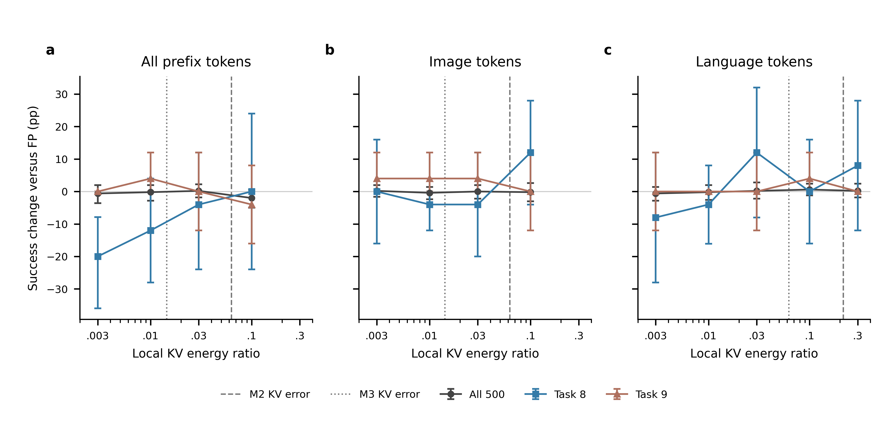
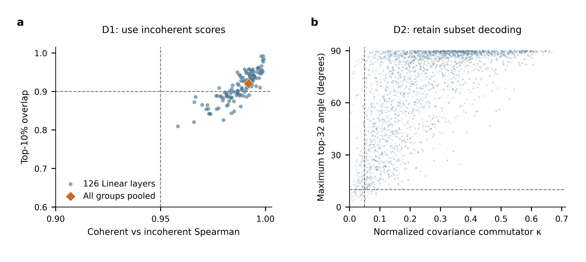
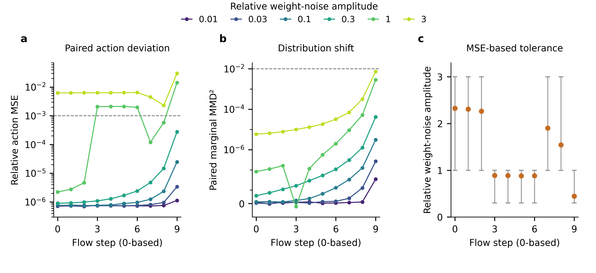
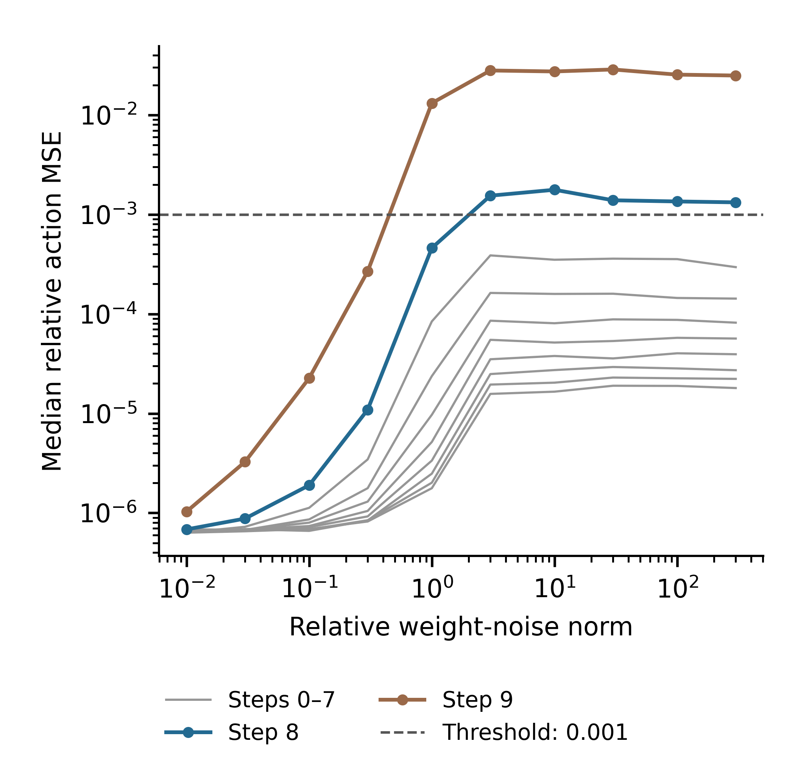
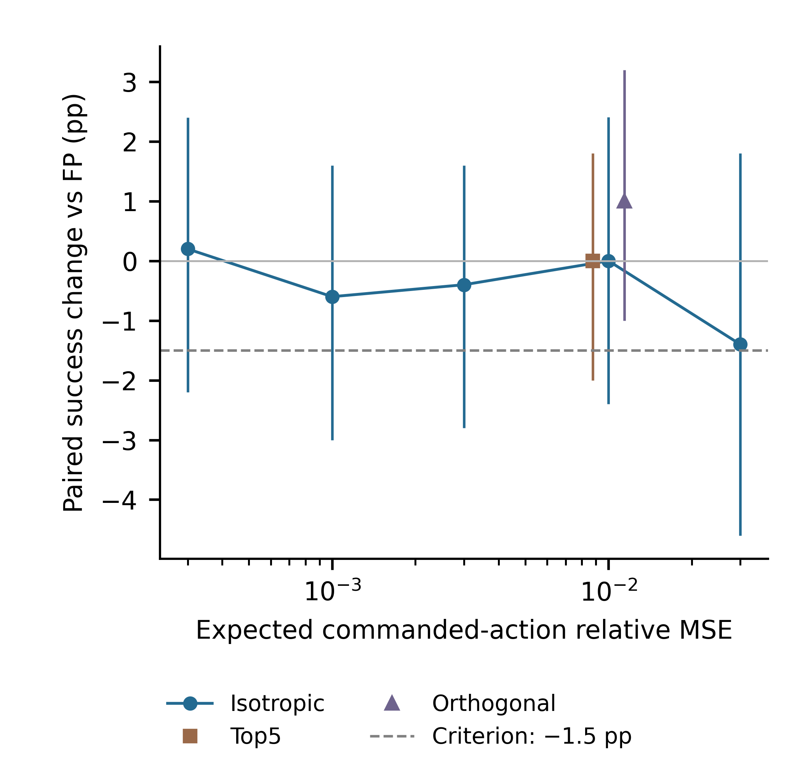

<!-- PLUSTRAIN_ROUND_BEGIN -->
# Current round — October 8: Plus-train calibration (P1), RAQ-FT (P2), A8 feasibility (P3)

C5 (demo-replay perturbation pipeline) is replaced by calibration on the official LIBERO-Plus training set (lerobot/libero_plus, pinned revision). Calibration banks: (a) LIBERO 256 (existing); (b) 256 Plus-train observations; (c) 128 LIBERO + 128 Plus-train. Validation: 300 Plus-train observations from disjoint episodes; it chooses all fine-tune hyperparameters and early stopping. The Plus test subset is never used for selection. FP has not seen Plus-train data.

| Row | Whole-model bpw | Calibration | Loss | Plus /1000 | Δ vs FP (pp; 95% CI) | Δ vs original 2-bit (pp; 95% CI) | LIBERO medium /1000 | Stage |
|---|---:|---|---|---:|---:|---:|---:|---|
| FP (never saw Plus-train) | — | — | — | 765 | +0.00 [+0.00,+0.00] | +6.10 [+1.71,+10.80] | — | reference; Plus complete |
| original 2-bit backbone + uniform M2 expert | 2.9226 | a: LIBERO 256 | original recipe | 704 | -6.10 [-10.80,-1.71] | +0.00 [+0.00,+0.00] | — | reference; Plus complete |
| H5b fine-tune on original 2-bit (loss-function control) | 2.9226 | a: LIBERO 256 | H5b direction loss | 732 | -3.30 [-7.15,+0.56] | +2.80 [-0.20,+5.94] | — | reference; Plus pending |
| P1 refit on Plus-train | — | b: Plus-train 256 | original recipe | — | — | — | — | not started; Plus pending |
| P1 refit on mixed | — | c: 128 LIBERO + 128 Plus-train | original recipe | — | — | — | — | not started; Plus pending |
| P1 H5b fine-tune on Plus-train (best-validation iterate) | — | b: Plus-train 256 | H5b direction loss | — | — | — | — | not started; Plus pending |
| P1 H5b fine-tune on mixed (best-validation iterate) | — | c: 128 LIBERO + 128 Plus-train | H5b direction loss | — | — | — | — | not started; Plus pending |
| P2 RAQ-FT on original 2-bit | — | a: LIBERO 256 | readout + 0.1 H5b | — | — | — | — | not started; Plus pending |
| P2 RAQ-FT control on C2 (3-bit deep layers) | — | a: LIBERO 256 | readout + 0.1 H5b | — | — | — | — | not started; Plus pending |
| P2 RAQ-FT coverage row | — | c: 128 LIBERO + 128 Plus-train | readout + 0.1 H5b | — | — | — | — | not started; Plus pending |
| P4 reference: 3-bit backbone + uniform M2 expert | 3.6390 | a: LIBERO 256 | original recipe | — | — | — | — | reference; Plus pending |

A8 feasibility rows (decision only: whether the final deployable row is W2A8; excluded from method selection):

| Row | Held-out action relative MSE vs FP | vs non-A8 base | Plus /1000 | Δ vs non-A8 base (pp; 95% CI) | Stage |
|---|---:|---:|---:|---:|---|
| FP + A8 | 4.229e-06 | 4.218e-06 | — | — | reference; Plus running |
| original 2-bit + 2-bit expert + A8 | 3.720e-02 | 5.352e-06 | — | — | reference; Plus running |
| row (ii) + per-token INT8 KV cache | 3.720e-02 | 5.651e-06 | — | — | reference; Plus running |

KV relative error (image / language) on training256 and savedPlus200, with D1 propagated-error fractions (language K/V, raw):

| Model | train256 image | train256 language | Plus200 image | Plus200 language | D1 K-prop | D1 V-prop |
|---|---:|---:|---:|---:|---:|---:|
| a8_2bit | 0.0623 | 0.2156 | 0.0712 | 0.3449 | 0.866 | 0.940 |
| bb_M2_ae_M2_fp32 | 0.0622 | 0.2155 | 0.0711 | 0.3445 | 0.867 | 0.940 |

Gate (unchanged): ≥ +3 pp over 704/1000 with paired 95% CI lower bound > 0 on the Plus subset. Gate status: **awaiting rows**.

[Protocol](PLUSTRAIN_2026-10-08.md) · [Results](results/plustrain_round.json). Older sections below are historical.

<!-- PLUSTRAIN_ROUND_END -->

<!-- PRECISION_ROUND_BEGIN -->
# Current round — C1–C5 precision interventions, October6 evening

This round replaces the previous dispatcher. C1 protects36 Gemma K/V projections in nativeBF16; C2 uses3bit for all28 eligible Linear layers in Gemma14–17 and2bit elsewhere. C3 starts from original2bit and runs2304 updates,16 latents andsteps0–9. C4 uses originalH5b budget onC2. Expert remains uniformM2. No new weighting scheme or targeted task8/9 evaluation.

| Model | Whole-model bpw | Camera /500 | Initial state /500 | Total /1000 | Δ vs FP (pp;95%CI) | Δ vs original2bit (pp;95%CI) |
|---|---:|---:|---:|---:|---:|---:|
| original_fp | — | 372 | 393 | 765 | +0.00 [+0.00,+0.00] | +6.10 [+1.71,+10.80] |
| bb_M2_ae_M2_fp32 | — | 346 | 358 | 704 | -6.10 [-10.80,-1.71] | +0.00 [+0.00,+0.00] |
| precision_c1 | 3.0004635964385584 | 348 | 368 | 716 | -4.90 [-9.19,-0.80] | +1.20 [-1.57,+4.00] |
| precision_c2 | 3.054192145405753 | 359 | 356 | 715 | -5.00 [-9.15,-0.59] | +1.10 [-1.48,+3.71] |
| precision_c3 | 2.9225899010064036 | 346 | 362 | 708 | -5.70 [-9.73,-1.72] | +0.40 [-2.86,+3.97] |
| precision_c4 | 3.054192145405753 | 354 | 373 | 727 | -3.80 [-7.90,+0.29] | +2.30 [-0.76,+5.53] |
| previous_h5b | — | 362 | 370 | 732 | -3.30 [-7.15,+0.56] | +2.80 [-0.20,+5.94] |

precision_c1: exact tensor-payload bpw **3.000463596**, change **+0.077873695**; added **32,643,036 bytes** relative to original2bit.

precision_c2: exact tensor-payload bpw **3.054192145**, change **+0.131602244**; added **55,164,928 bytes** relative to original2bit.

C3 4-GPU continuation: The parallel job ended with CANCELLED before a successful handoff was recorded. Scheduler: 189890 CANCELLED. The original single-GPU run is retained until the guards pass; handoff then resumes its latest saved update. The fixed budget remains2304 updates,16 latents andsteps0–9. Execution proofs are included in the result artifact.

All candidates first receive the same paired seed7 Plus500+500 subset and per-layer image/language K/V errors, attention entropy and S1 decomposition. Only complete1000-episode outcomes enter the table. Raw training curves are included in the result artifact; figures have a separate visual-review gate.

CoverageH5b triggers only on positive paired improvement with95%CI lower bound>0, as approved by the user. Promotion remains≥3pp over original2bit with paired95%CI excluding0; wait for core and triggered candidates, freeze one best winner. Final LIBERO2000/1900 and expandedPlus1000+1000 with originalsubset reuse remain unchanged. Coverage also retains medium1000/950.

Promotion: **awaiting_all_candidates**. Failed current jobs: **[{'job': 188643, 'stage': 'coverage', 'key': 'coverage_exact_pilot', 'state': 'FAILED'}]**. Coverage stage evidence: **{'exact_actions_pilot': {'status': 'failed', 'sha256': 'c09bc4cd5140e3531e2fc11e183c51b82e29282916bbca582491e43e23a43971'}}**. A failed scientific/data check blocks its branch rather than silently retrying or relaxing tolerances.

[Protocol](PRECISION_2026-10-06.md) · [Results and raw training curves](results/precision_round.json). Older sections below are historical.

Authoritative amendment: [complete October7 addendum](ADDENDUM_2026-10-07.md), with the replacement D3 incorporated alongside D1. D3 covers all40 tasks offline (1600 observations,32 paired latents) and three pairedPlus500+500 FP-prefix interventions; reports TV, reader-visible energy and realizability diagnostics. A8 has three separate feasibility rows, excluded from backbone-method selection. Numerical targets are predictions. C1–C5 continue. The unchanged winning checkpoint no longer dispatches directly to final evaluation: A8 feasibility and composed-row validation precede LIBERO2000/1900 and expandedPlus2000. D1/D3/A8 execution remains pending validated implementations.

<!-- PRECISION_ROUND_END -->

<!-- PLUS_ROUND_BEGIN -->
# Current round — Plus selection, October 6

**This policy supersedes all scheduling and H4 gates in the archived sections below.** No further targeted LIBERO-10 task8/9 evaluation or model selection. H4/H4b are stopped; retain the task9 gallery and completed FP task8 rerun as historical evidence. H5 evaluation no longer waits for labels.

Method/intervention comparisons use the original paired seed7 Plus500camera+500initial-state subset. Final deployable rows and the two calibration-coverage variants retain the complete40-task LIBERO1000/2000 protocol, with excluding-task8/9 columns950/1900 alongside. Published-baseline comparability is preserved.

| Model | Camera /500 | Initial state /500 | Combined /1000 | Δ vs FP (pp; paired95% CI) | Δ vs original2-bit (pp; paired95% CI) |
|---|---:|---:|---:|---:|---:|
| original_fp | 372 | 393 | 765 | +0.00 [+0.00, +0.00] | +6.10 [+1.71, +10.80] |
| bb_M2_ae_M2_fp32 | 346 | 358 | 704 | -6.10 [-10.80, -1.71] | +0.00 [+0.00, +0.00] |
| s2_fp_scaled | 379 | 387 | 766 | +0.10 [-2.67, +2.89] | +6.20 [+1.93, +10.71] |
| causal_h5a | 344 | 355 | 699 | -6.60 [-11.29, -2.10] | -0.50 [-4.14, +2.96] |
| causal_h5b | 362 | 370 | 732 | -3.30 [-7.15, +0.56] | +2.80 [-0.20, +5.94] |
| causal_h5c4 | 340 | 360 | 700 | -6.50 [-11.05, -2.30] | -0.40 [-3.46, +2.60] |
| causal_h5c16 | 341 | 364 | 705 | -6.00 [-10.45, -1.91] | +0.10 [-2.59, +2.64] |
| s2_gain_corrected | 335 | 370 | 705 | -6.00 [-10.66, -1.47] | +0.10 [-2.27, +2.42] |
| expert_only_uniform_M2 | 374 | 387 | 761 | -0.40 [-3.67, +2.73] | +5.70 [+1.52, +9.93] |

Only complete, validated1000-episode rows appear. Pending: coverage_mixed_backbone, coverage_mixed_both.

S1 fits per-layer/type joint-KV gain on training256 only and partitions error energy into mean, centered proportional and orthogonal residual. S2(a) scales FP cachedKV; S2(b) corrects2-bit cachedKV by reciprocal gain. Prefix-conditioned expert-attention entropy and KV errors use fixed200 saved Plus observations. H5a/b/c4/c16 and S2(b) share the table above; coverage includes both-component and backbone-only refits.

Promotion: **awaiting_all_candidates**. After all seven deployable candidates complete, the highest-scoring candidate must improve by≥3pp over the original2-bit model with paired95% CI excluding0. Freeze one winner and run LIBERO full2000. Expand Plus to1000camera+1000initial-state, retaining the existing subset; report expanded2000 and added1000 separately. The expanded score is not independent confirmation.

[Protocol](PLUS_ROUND_2026-10-06.md) · [Complete paired results and diagnostics](results/plus_round.json). Older sections below are archived evidence and their former future-work gates are inactive.

<!-- PLUS_ROUND_END -->

<!-- EVALUATION_SPLIT_BEGIN -->
# Evaluation split and calibration coverage — October 5

LIBERO four-suite full/medium evaluation retains the headline lossless claim and published-baseline comparison. **The fixed LIBERO-Plus 500 camera + 500 initial-state subset is now the primary method-variant benchmark**, including H5a/b/c/d, phase-weighted calibration, activation variants and calibration coverage. Each completed row is paired against FP and the original 2-bit backbone + uniform-M2 expert.

| Model | Camera /500 | Initial state /500 | Combined /1000 | Paired Δ vs FP (pp; 95% CI) | Paired Δ vs original 2-bit (pp; 95% CI) |
|---|---:|---:|---:|---:|---:|
| FP | 372 | 393 | 765 | +0.00 [+0.00, +0.00] | +6.10 [+1.71, +10.80] |
| original_2bit_uniform_M2 | 346 | 358 | 704 | -6.10 [-10.80, -1.71] | +0.00 [+0.00, +0.00] |
| expert_only_M1 | 350 | 366 | 716 | -4.90 [-9.44, -0.47] | +1.20 [-2.81, +5.10] |
| M2_FlowVQ | 341 | 355 | 696 | -6.90 [-12.18, -2.12] | -0.80 [-3.61, +1.79] |
| a_M2 | 374 | 387 | 761 | -0.40 [-3.67, +2.73] | +5.70 [+1.52, +9.93] |

Per-dimension paired differences, confidence intervals and discordant episode counts are in [the full table](results/evaluation_split.json). Partial evaluations have no success-rate row. The expert-only uniform-M2 run is reused; no duplicate evaluation is submitted.

Calibration coverage: **blocked_on_failed_stage**. The primary mixed set keeps256 observations from the original60 training episodes:128 unchanged +64 independently sampled camera perturbations +64 initial-state perturbations. Two equal-bit variants share the new backbone: (a) both backbone and expert refit; (b) backbone refit with the original expert. Each receives Plus1000 and LIBERO medium1000, paired against both references; image/language KV error and mean-error energy fractions are reported. Exact FP32 trace(J_D,9)/70 is measured on the128 perturbed observations and their matched clean counterparts. No Plus test instances enter calibration. [Protocol](CALIBRATION_COVERAGE_2026-10-05.md).

<!-- EVALUATION_SPLIT_END -->

<!-- STRUCTURE_ROUND_BEGIN -->
# Evening update — structure, not magnitude

H3b has priority; all H5 evaluation requires completed H3b and complete H4 failure review. Seed7, at most8 GPUs. H2TV remains appendix-only diagnostic evidence. [Registered protocol](STRUCTURE_2026-10-05.md). [Validated evidence](results/structure_round.json).

H3b: 4/4 workers passed256 exact zero/FP and256 exact unit/H1c action guards; 10/10 paired400-episode conditions complete. Additional unit-injection500 mix: complete.

Mean-only and residual-only use per-observation layer/type means; H5d uses calibration-wide means. Random signs are shared acrossK/V and all layers for a given token. Token permutation preserves the receiving-position jointK/V error norm; layer permutation is retained. No new mechanism verdict before measured comparisons.

| Condition | Task8 | Task9 |
|---|---|---|
| unit | 180/200; Δ+34.0pp [26.0, 42.0] | 160/200; Δ-13.5pp [-20.5, -7.000000000000001] |
| mean | 105/200; Δ-3.5pp [-10.0, 3.0] | 172/200; Δ-7.5pp [-13.0, -2.5] |
| residual | 174/200; Δ+31.0pp [23.5, 38.5] | 188/200; Δ+0.5pp [-3.0, 4.0] |
| random_sign | 19/200; Δ-46.5pp [-55.00000000000001, -38.0] | 67/200; Δ-60.0pp [-68.0, -52.0] |
| half | 131/200; Δ+9.5pp [2.0, 17.012499999999818] | 181/200; Δ-3.0pp [-8.0, 1.5] |
| quarter | 133/200; Δ+10.5pp [2.5, 18.5] | 181/200; Δ-3.0pp [-8.0, 1.0] |
| double | 38/200; Δ-37.0pp [-47.5, -26.5] | 41/200; Δ-73.0pp [-80.5, -65.0] |
| token_permute | 47/200; Δ-32.5pp [-41.5, -23.5] | 99/200; Δ-44.0pp [-52.5, -35.5] |
| layer_permute | 111/200; Δ-0.5pp [-10.5, 9.0] | 182/200; Δ-2.5pp [-7.5, 2.5] |
| negative | 0/200; Δ-56.0pp [-64.0, -47.5] | 19/200; Δ-84.0pp [-89.0, -78.5] |

H4b uses saved observations only, a5-step query grid and50-control-step windows, with the last50 steps excluded. Report undetected cases and0.5/1/2cm sensitivity. SuccessfulFP andM2 task9 episodes are additional phase controls. The15 historical “other” episodes are candidates, not15 proven cup-in failures;8 have final containment.

Plus-J compares200 perturbed observations with200 matched baseline observations, reporting trace(J_D,9)/70 inFP32. This trace is a diagnostic surrogate, not a measured posterior variance. Expert-only uniformM2 runs the original500+500Plus subset. H5a/b/c are retained andH5d adds calibration-only cachedKV bias correction.

## Appendix — H2 TV diagnostic table

The detector gate failed: tasks8/9 are not both among the top5 TV tasks for either2-bit backbone. Retained only as descriptive evidence; no decision-change metric or optimization success claim.

| Model | Mean TV | Mode agreement | Task8 / Task9 TV ranks |
|---|---:|---:|---|
| bb_M2_ae_M2_fp32 | 0.39498047 | 0.604746 | 14 / 8 |
| story_plain_bb_M2_ae_M2_fp32 | 0.35410156 | 0.645527 | 11 / 6 |
| bb_M3_ae_M2_fp32 | 0.04287109 | 0.957129 | 5 / 6 |
| a_M1 | 0.07298828 | 0.927012 | 12 / 4 |
| h1a | 0.00072266 | 0.999277 | 14–40 / 14–40 |
| h1d | 0.00306641 | 0.996934 | 9–11 / 3 |

All1600 evaluation observations per model. [Full per-observation distributions and mode agreement](results/causal_h2_followup.json).
<!-- STRUCTURE_ROUND_END -->

# Archived experiments — October5 causal follow-up — 2026-10-08 21:24 SGT

H3: complete; completed conditions: 15. H2 detector verdict: drop_metric_from_paper. H5 fitting is authorized; evaluation waits for H4 failure labels. Only completed validated milestones publish. [Evidence](results/causal_round.json). Older rounds below are historical.

<!-- CAUSAL_ROUND_BEGIN -->
## October5 causal follow-up

Historical Gaussian-H3 round. The evening structured-error protocol now sets scheduling priority; all H5 evaluation additionally waits for completed H3b. Seed7 only, at most8GPUs.

### H3 — Prefix-KV intervention

Status: complete.13 primary conditions ×500 paired episodes, including language-only0.3. Two additional equal-total-energy0.01 conditions retain the earlier secondary check; the all-token0.01 row is reused. Primary energy uses each token group's own KV norm. K/V noise is fixed through the ten expert steps, padding is excluded, and a separate RNG preserves policy-noise pairing. Zero-dose exact256-action checks passed on 8 workers.

Prediction: language perturbation near the measured M2 local error0.215 reproduces task8 gain/task9 loss; image perturbation near0.062 does not. The specified0.1/0.3 and0.03/0.1 grids bracket these anchors; no interpolated response is counted as a measurement.

| Condition | All500 | Excluding tasks8/9 (450) | Local energy | Total energy |
|---|---|---|---:|---:|
| local_all_0.003 | 478/500; Δ-0.6pp [-3.6,+2.0] | 445/450; Δ+0.4pp [-1.8,+2.4] | 0.0030027 | 0.0030027 |
| local_all_0.01 | 480/500; Δ-0.2pp [-2.8,+2.0] | 444/450; Δ+0.2pp [-2.0,+2.2] | 0.010003 | 0.010003 |
| local_all_0.03 | 482/500; Δ+0.2pp [-1.8,+2.2] | 445/450; Δ+0.4pp [-1.6,+2.2] | 0.030003 | 0.030003 |
| local_all_0.1 | 471/500; Δ-2.0pp [-5.0,+0.6] | 434/450; Δ-2.0pp [-4.7,+0.7] | 0.1 | 0.1 |
| local_image_0.003 | 482/500; Δ+0.2pp [-1.6,+2.0] | 443/450; Δ+0.0pp [-1.8,+1.8] | 0.0030027 | 0.0029877 |
| local_image_0.01 | 479/500; Δ-0.4pp [-2.4,+1.4] | 441/450; Δ-0.4pp [-2.4,+1.3] | 0.010003 | 0.0099527 |
| local_image_0.03 | 481/500; Δ+0.0pp [-2.2,+2.0] | 443/450; Δ+0.0pp [-2.0,+2.0] | 0.030003 | 0.029852 |
| local_image_0.1 | 480/500; Δ-0.2pp [-3.0,+2.6] | 439/450; Δ-0.9pp [-3.6,+1.8] | 0.1 | 0.099502 |
| local_language_state_0.003 | 478/500; Δ-0.6pp [-2.8,+1.4] | 442/450; Δ-0.2pp [-2.0,+1.8] | 0.0030027 | 1.4993e-05 |
| local_language_state_0.01 | 480/500; Δ-0.2pp [-2.6,+2.0] | 443/450; Δ+0.0pp [-2.4,+2.2] | 0.010003 | 4.994e-05 |
| local_language_state_0.03 | 482/500; Δ+0.2pp [-2.2,+2.8] | 441/450; Δ-0.4pp [-2.4,+1.6] | 0.030003 | 0.00015002 |
| local_language_state_0.1 | 484/500; Δ+0.6pp [-1.2,+2.4] | 445/450; Δ+0.4pp [-1.1,+2.0] | 0.1 | 0.00050142 |
| local_language_state_0.3 | 482/500; Δ+0.2pp [-1.8,+2.4] | 442/450; Δ-0.2pp [-2.2,+1.6] | 0.3 | 0.0015019 |
| total_image_0.01 | 476/500; Δ-1.0pp [-3.6,+1.2] | 441/450; Δ-0.4pp [-2.4,+1.3] | 0.010053 | 0.010003 |
| total_language_state_0.01 | 460/500; Δ-4.2pp [-9.4,+0.0] | 434/450; Δ-2.0pp [-4.9,+0.7] | 2.0256 | 0.01 |

Primary result: all6500 episodes complete. Language-local0.3 gives task8 16/25 versus FP14/25 (paired Δ+8.0pp,95%CI [-12.0, 28.000000000000004]), task9 24/25 versus FP24/25. The tested0.1/0.3 language doses do not establish the predicted task8-gain/task9-loss pattern. This conclusion is limited to these Gaussian intervention directions, doses and25 episodes per task; quantization error directions were not reproduced.

### H2 — Diagnostic only

The TV detector failed its registered gate. The per-model table and distributions are retained in the evening appendix as diagnostics; TV is not a paper decision-change metric. [Full diagnostic distributions](results/causal_h2_followup.json).

### H4 — Full FP rerun and failure causes

New FP task8 rerun: complete; cause labels: pending. All200 IDs50–249 require both camera views and simulator-state trajectories. Existing M2 task9 trajectories supply the matching failure review; earlier diagnostic replay does not replace this new full rerun.

M2 task9 cause review: {"timeout_without_progress": 12, "other": 15, "collision_knockover": 6}. All33 failures; Single unblinded agent rater; cause is descriptive/proximate, not a proven internal decision; ambiguous cases use other. Both views at disclosed transfer/grasp-end/timeout snapshots and full-state summaries were inspected; this is not frame-by-frame human video coding.

FP historical diagnostic replay reproduced49 of88 failures;39 became successes. Its reviewed labels do not describe the missing original failures. The new full200 run uses the exact historical FP server; diagnostic annotations transfer only on exact saved-array identity. Final FP cause distribution and any consistent-wrong-decision verdict remain pending.

### LIBERO-Plus — Identical paired dimensions

All requested comparators were already complete on the identical pre-registered instances and passed strict source/coverage checks; reuse5000 accepted model-episodes, with no full10030 score.

| Dimension | Model | All instances | Excluding task8/9 bases | Paired Δ vs FP (all), pp |
|---|---|---|---|---|
| Camera Viewpoints | x6b_fp | 372/500 | 364/475 | +0.0 [+0.0,+0.0] |
| Camera Viewpoints | x6b_uniform | 346/500 | 344/475 | -5.2 [-10.3,-0.0] |
| Camera Viewpoints | x6b_expert_M1 | 350/500 | 346/475 | -4.4 [-10.0,+1.4] |
| Camera Viewpoints | x6b_flowvq | 341/500 | 339/475 | -6.2 [-12.0,-0.8] |
| Camera Viewpoints | 2bit_2steps | 349/500 | 348/475 | -4.6 [-9.2,+0.2] |
| Robot Initial States | x6b_fp | 393/500 | 376/476 | +0.0 [+0.0,+0.0] |
| Robot Initial States | x6b_uniform | 358/500 | 351/476 | -7.0 [-14.2,-0.6] |
| Robot Initial States | x6b_expert_M1 | 366/500 | 349/476 | -5.4 [-12.2,+0.7] |
| Robot Initial States | x6b_flowvq | 355/500 | 347/476 | -7.6 [-14.8,-0.8] |
| Robot Initial States | 2bit_2steps | 356/500 | 346/476 | -7.4 [-13.9,-1.4] |

### H5 — Backbone fitting, evaluation after H4

H5a: early0–5 direction-gradient backbone weighting. H5b: backbone codebooks only, fixed uniform-M2 expert/codes/scales/norms,8 paired latents. H5c4/H5c16: valid-language-token input contributions weighted4x/16x in the layer Hessian. No held-out observations enter fitting. Every variant must report image/language KV errors, diagnostic TV, paired200 episodes/task8/task9, and medium1000. TV remains a failed detector, even if a fitter improves it.

| Variant | Fitting | Evaluation |
|---|---|---|
| h5a | complete | gated_on_H4_labels |
| h5b | complete | gated_on_H4_labels |
| h5c4 | complete | gated_on_H4_labels |
| h5c16 | complete | gated_on_H4_labels |

[Annotated task9 failure gallery: all33 failures, both cameras and representative animations](H4_TASK9_FAILURE_GALLERY.md)

Machine-readable [causal round](results/causal_round.json).
<!-- CAUSAL_ROUND_END -->

<!-- DECISIONS_ROUND_BEGIN -->
## Decisions, not actions

Active protocol: seed7, paired episode IDs, L40S persistent BF16 cache. The10,030-instance FP LIBERO-Plus run is canceled; existing partial rows are archived, not a full-set score. Only the fixed500+500 comparison and a separate300-instance installation check remain. All success results in this round include the scope excluding LIBERO-10 tasks8/9. Older sections are historical.

### H1 — Hybrid-step models

| Model | Task8 /200 | Task9 /200 | Excluding tasks8/9 |
|---|---|---|---|
| fp | 112/200 (56.0%); Δ +0.0pp [+0.0, +0.0] | 187/200 (93.5%); Δ +0.0pp [+0.0, +0.0] | N/A (N=0) |
| uniform | 184/200 (92.0%); Δ +36.0pp [+29.0, +43.5] | 167/200 (83.5%); Δ -10.0pp [-17.0, -4.0] | N/A (N=0) |
| h1a | 131/200 (65.5%); Δ +9.5pp [+1.5, +17.5] | 186/200 (93.0%); Δ -0.5pp [-5.0, +3.5] | N/A (N=0) |
| h1b | 172/200 (86.0%); Δ +30.0pp [+21.0, +38.5] | 173/200 (86.5%); Δ -7.0pp [-13.5, -1.5] | N/A (N=0) |
| h1c | 181/200 (90.5%); Δ +34.5pp [+26.0, +43.0] | 160/200 (80.0%); Δ -13.5pp [-20.5, -7.0] | N/A (N=0) |
| h1d | 118/200 (59.0%); Δ +3.0pp [-6.5, +12.5] | 182/200 (91.0%); Δ -2.5pp [-7.5, +2.0] | N/A (N=0) |

G-H1 passes the predeclared half-gain criterion; this gate alone does not establish the full hypothesis.

H1a: FP backbone, FP expert0–8 / uniform M2 expert9. H1b: M2 backbone, M2 expert0–8 / FP expert9. H1c: M2 backbone, FP expert throughout. H1d: FP backbone, uniform M2 expert throughout. No refitting.

Reject if H1a≥148/200, H1b<148/200, or H1c<148/200 on task8. Baseline112/200 versus184/200 gives a36pp gain; half is18pp. These task8-only counts have N=0 after exclusion. Intervals use paired50-initial-state-cluster bootstrap, retaining four noise repeats. Six-model bar chart awaits complete data and visual review.

Post-task8 mechanism update: the main gain is driven by backbone quantization (H1c181/200 versus full uniform184/200); expert-only H1d118/200 is close to FP112/200. Last-step-only H1a131/200 gives a smaller significant +9.5pp (paired95% CI[1.5,17.5]). Similar counts do not establish equivalence. The working mechanism is that decisions are set in the VLM prefix/KV cache and the expert sets action precision. Direct KV causality and within-mode precision remain to be tested in H3/H2; the early-expert decision account is no longer the main hypothesis.

### H2 — Mode shifts

Status: complete. The256 training-calibration observations,1600 evaluation-initial-state observations (40×40), and256 observations from40 held-out trajectories remain separate banks. All models share32 latents per observation. Cluster the35 training-standardised action dimensions; silhouette k=2..4, primary threshold0.25 and sensitivities0.20/0.30. A centroid-distance/pooled-within-cluster-RMS ratio<2 also implies unimodality. Report disagreement and fixed-k2 TV. Correlations/scatters and task8/task9/control projections await action banks and manual physical interpretation.

Seven model rows: FP, uniform M2 backbone+M2 expert, M3 backbone+M2 expert, plain-VQ M2 backbone+M2 expert, expert-only M1, H1a and H1d. New prediction: large mode-shift TV for2-bit backbones; near-zero TV for expert-only2-bit H1a/H1d and3-bit backbone. H1a/H1d receive the same all40-task offline evaluation; their40-task success correlations are N/A because only task8/9 success sets exist. The original five-model medium endpoints are unchanged.

H2 correlations with signed task-success change (Spearman rho; full40-task endpoint and38-task exclusion robustness):

| Model | Tasks | TV | Overall MSE | Within-mode MSE | Fixed-k2 TV |
|---|---:|---:|---:|---:|---:|
| bb_M2_ae_M2_fp32 | all40 | -0.0774 | -0.0220 | -0.0568 | -0.1014 |
| bb_M2_ae_M2_fp32 | excluding8/9 | -0.0516 | 0.0082 | 0.0008 | -0.0772 |
| bb_M3_ae_M2_fp32 | all40 | -0.1066 | 0.0273 | 0.0230 | 0.0060 |
| bb_M3_ae_M2_fp32 | excluding8/9 | -0.1261 | 0.0466 | 0.0476 | 0.0054 |
| story_plain_bb_M2_ae_M2_fp32 | all40 | -0.1829 | -0.1864 | -0.1495 | -0.3631 |
| story_plain_bb_M2_ae_M2_fp32 | excluding8/9 | -0.1815 | -0.1272 | -0.0652 | -0.3629 |
| a_M1 | all40 | -0.2435 | 0.2510 | 0.2430 | 0.0309 |
| a_M1 | excluding8/9 | -0.2631 | 0.2977 | 0.2943 | 0.0589 |
| h1a | all40 | N/A | N/A | N/A | N/A |
| h1a | excluding8/9 | N/A | N/A | N/A | N/A |
| h1d | all40 | N/A | N/A | N/A | N/A |
| h1d | excluding8/9 | N/A | N/A | N/A | N/A |

Scatters/cluster figures and physical descriptions await manual inspection; per-task metrics and every inspection artifact are in [H2 evidence](results/decisions_h2.json).

### H3 — Prefix-KV dose response

Status: after_H2_H4_full; prefix_KV_rollout_requires_implementation. Perturb both K/V in the FP prefix cache with Gaussian noise, fixed through the expert trajectory. Three groups: all valid tokens, image only, language/state only. The pinned config has no state tokens: the third group is language only. Exclude padding and masked image slots. Primary doses0.003/0.01/0.03/0.1 use each selected group's own KV energy (squared Frobenius norm);12 conditions,500 paired episodes each (spatial+LIBERO-10,25/task,seed7). Secondary comparison uses0.01 total valid prefix energy for each of the three groups, separately reported; reuse the identical all-token0.01 condition. Always report local and total actual post-BF16 energy ratios. Zero-dose256-action identity is required before rollout.

KV dose anchors: complete. Measure actual M2/M3 backbone KV error on256 calibration observations, separately for image and language/state tokens, reporting both local and total ratios and per-observation distributions. Mark these on the H3 plot beside the dose curves/X4 and state whether the fixed dose range brackets them. Existing SVD results and early-expert perturbation move to an appendix; new appendix GPU runs are allowed only on otherwise idle cards.

Appendix (superseded main H3): mean top10 singular values = [0.7720, 0.5823, 0.4909, 0.4301, 0.3821, 0.3417, 0.3053, 0.2744, 0.2461, 0.2228]. Mean of the three principal angles over124,750 observation pairs = 59.46°. This descriptive result alone does not establish a shared decision subspace. [Per-observation spectra and source hashes](results/decisions_spectrum.json). Any further early-expert directional probes/rollouts are idle-GPU appendix work only.

Measured KV dose anchors (pooled squared energies over256 calibration observations):

| Backbone | Token group | Local error ratio | Total error ratio | In primary dose range |
|---|---|---:|---:|---|
| bb_M2_ae_M2_fp32 | all | 0.0629402 | 0.0629402 | True |
| bb_M2_ae_M2_fp32 | image | 0.0622505 | 0.0619696 | True |
| bb_M2_ae_M2_fp32 | language_state | 0.215064 | 0.0009706 | False |
| bb_M3_ae_M2_fp32 | all | 0.0143902 | 0.0143902 | True |
| bb_M3_ae_M2_fp32 | image | 0.014173 | 0.014109 | True |
| bb_M3_ae_M2_fp32 | language_state | 0.0623011 | 0.000281169 | True |

[Per-observation KV errors, distributions and source hashes](results/decisions_kv_anchors.json). H3 curves/anchor plot remain pending until rollouts and figure review finish.

### H4 — Component isolation and failure causes

Status: component_complete_failure_review_pending; task8 failure review: manual_cause_review_pending. Plain-VQ M2+M2 needs200 episodes on each task. Newly collected trajectories retain both camera views, simulator states and executed actions. Historical FP task8 outcomes lack trajectories; diagnostic replays and manual labels for all88 failures are required. No cause is inferred from a timeout alone. Replay/original outcome disagreements remain explicit and never replace original success outcomes.

### H5 — Decision-preserving calibration

Status: blocked_on_prerequisites. Start only after G-H1 passes, all six paired task9 sets finish, and H4 task8 manual failure-cause analysis is complete. Blockers: H4_task8_failure_cause_review_incomplete.

Backbone-only objective: match early-step0–5 velocity directions under quantized versus FP prefix KV, averaged over8 paired latents. Both sides use the same frozen uniform-M2 expert and the same teacher x_k/t_k. H5a uses direction-loss gradient importance to refit backbone codebooks/codes. H5b fine-tunes backbone codebooks only; codes, scales, norms, embeddings/projections and expert stay frozen. The old terminal-action MSE term and expert optimization are removed. Same60 training-calibration episodes, bpw, evaluation protocols and≤1GPU-day fine-tune cap. G-H5 still requires at least30% lower TV in one variant; otherwise report that no decision-preserving calibration was found.

### Prediction verdict

Task8 supports the backbone attribution and passes G-H1; it does not support early expert steps as the main source of the gain. The small H1a effect must also be retained. Task9 replication, prefix-KV mode shifts and causality, within-mode precision, and any successful backbone calibration remain pending.

### H6 — Bookkeeping

| Protocol | All tasks | Excluding LIBERO-10 tasks8/9 | Status |
|---|---|---|---|
| full | 1954/2000 (97.7%) | 1866/1900 (98.2%) | complete |
| medium1 | 972/1000 (97.2%) | 934/950 (98.3%) | complete |
| medium2 | 968/1000 (96.8%) | 931/950 (98.0%) | complete |
| plus2 | 705/1000 (70.5%) | 694/951 (73.0%) | complete |
| install300 | 290/300 (96.7%) | 290/300 (96.7%) | complete |

Machine-readable evidence: [decisions_round.json](results/decisions_round.json). Protocol changes and every released milestone are recorded in EXPERIMENTS.md.
<!-- DECISIONS_ROUND_END -->

# Current result — FlowVQ main-method end-to-end validation complete

Both quantized-backbone FlowVQ policies now have strict reload, paired held-out MSE, independent safetensors accounting, and full four-suite seed7 validation. The authoritative five-row result is [MAIN_METHOD_TABLE.md](MAIN_METHOD_TABLE.md); all paired intervals and source hashes are in [complete evidence](results/flowvq_main_complete.json). The requested table is complete; no deferred experiment is authorized or dispatched by this controller.

# 2026-10-03 进度核查：每组 500/2000，最终表格未完成

本次初始核查时，两组 FlowVQ 各完成 500 个唯一回合（25%），不能据此报告完整成功率或配对区间。恢复后已有 4 张 L40S 正在补跑，最后一对 worker 等待作业名额。原汇总进程因 Slurm 数据库连接失败退出，现已加入查询重试并重启；待运行作业转入普通 rose 队列。检查点、已完成回合和评测协议保持不变。见 [恢复记录与作业状态](WORK_STATE.md) 和 [进度证据](results/flowvq_main_progress_20261003.json)。

# 2026-10-03 主方法端到端验证：offline 完成，full 待完成

仅推进用户指定的两组 FlowVQ 组合。两份检查点已组装并通过严格重载、保留张量一致性和完整 held-out 检查；独立 safetensors 核算见 [accounting](results/flowvq_main_accounting.json)。M3+FlowVQ 相对动作 MSE 为 **0.00730857**，匹配 uniform 为 **0.01304602**；M2+FlowVQ 为 **0.04291682**，匹配 uniform 为 **0.03721696**。两组都必须完成 seed7 的 2000 回合，当前不能声称 full 结果或最终表格完成。新任务定义见 [main-method protocol](MAIN_METHOD_2026-10-03.md)，作业唯一登记在 `runs/flowvq_main/jobs.json`；没有启动其他实验分支。

# 当前实验报告 — 2026-10-03

## 2026-10-03 最终验收（E059）：本轮实验全部完成

**本轮GPU实验于10月2日22:43:40（新加坡）结束，CPU调度器于22:44:40完成汇总，全部正常退出。当前无运行/排队作业，不占GPU。** 原 evening addendum 的组合验证、b*/c/d medium、P4离线与embedding gate/screen均已完成；条件性混合骨干回退未触发，没有追加P4 rollout或新seed。[完成记录](results/evening_completion_20261003.json)。

组合部署结论保持不变：**M3 backbone + M2 expert + FP32 AdaRMS表 + int8，whole-model 3.638965bpw，在full中1948/2000＝97.4%，匹配FP96.4%，差值+1.0pp，配对95%CI [-0.35,+2.65]pp**，通过既定≤1.5pp损失门槛。M2 backbone组合只完成medium（98.2%），未跑full，不能跨协议直接排序。[完整部署结果](results/evening_deployment_full.json)。

专家消融已全部完成，骨干BF16、embedding int8；统一四套件×10任务×25eps/task×seed7，共1000回合，匹配FP970/1000。完整汇总严格检查通过，229份来源哈希和d的1000个唯一episode及966次成功独立核对一致：

| expert配置 | medium成功率 | held-out相对动作MSE | 相对匹配M1恢复pp | expert逻辑读取/M1 | 读取≤1.1×且恢复≥1.5pp |
|---|---:|---:|---:|---:|---|
| uniform M1 | 94.1% | 0.01067682 | 0 | 1.000000× | 对照 |
| uniform M2 | 96.8% | 0.00016196 | +2.7 | 1.983453× | 存储对照 |
| b* | 96.3% | 0.00397198 | +2.2 | 1.098345× | 点估计通过 |
| c | 96.2% | 0.00277563 | +2.1 | 1.121323× | 读取超预算 |
| d | **96.6%** | **0.00448408** | **+2.5** | **1.121323×** | **读取超预算** |

新完成的d为966/1000，四套件各250回合成功数为241/248/244/233；相对FP差值−0.4pp，配对95%CI [-1.90,+1.10]pp。相对M1恢复+2.5pp（CI [-0.90,+5.90]pp），相对M2为−0.2pp（CI [-1.90,+1.60]pp）。d的实际expert存储2.104199bpw、81,913,068bytes，与c相同；比uniform M2/b*额外2,359,296bytes。逻辑读取449,742,060bytes/inference，超过1.1×预算，不能宣称联合目标已通过。

**复杂度增加尚未带来通过预定门槛的增量收益。** c相对b*的离线MSE改善30.12%，但带来存储/读取开销，medium成功率未改善；d相对c的medium点估计只增加0.4pp，预定主指标held-out MSE反而增大61.55%，未达到“再改善≥5% MSE或≥1.5pp成功率”的增益门槛。b*是本轮唯一按点估计满足恢复/读取联合目标的消融；三个恢复区间均跨0，不能据此宣称统计确定的收益、等价或跨seed稳健性。所有读取数字为逻辑张量计数，不是实测DRAM或延迟。[完整消融统计、比较口径及来源](results/evening_ablations_medium.json)。

P4三个配置均已完成离线验证，保持无rollout；完整数值见[离线汇总](results/evening_p4_offline.json)。下方旧进度为历史快照，以本节为准。本次只完成验收与报告同步，没有启动下一轮实验。

## 2026-10-02 22:07（新加坡）结果更新（E058）：组合 full 完成，b*/c 完成，d 收尾

**Backbone M3 + expert M2 + FP32 AdaRMS表 + int8 已通过完整2000回合协议：1948/2000＝97.4%，对照FP1928/2000＝96.4%，差值+1.0pp，配对95%CI [-0.35,+2.65]pp。** 整体成功率95%CI [95.65%,98.80%]；57个配对改善、37个退化。四套件各500回合、seed7，完整复用1000个已验收medium回合并新增1000回合。最后一个worker在18:17正常完成，四个full作业均COMPLETED/0:0；49份来源哈希独立核对一致。

| full套件（各500回合） | FP成功数 | M3 backbone + M2 expert成功数 |
|---|---:|---:|
| LIBERO-Spatial | 491 | 496 |
| LIBERO-Object | 494 | 495 |
| LIBERO-Goal | 484 | 489 |
| LIBERO-10 | 459 | 468 |

该组合whole-model实际3.638965bpw、张量payload1,525,378,532bytes，满足预定≤1.5pp损失门槛。区间跨0，结果条件于单seed，不能声称显著优于FP、统计等价或跨seed泛化。M2 backbone的98.2%仍仅为1000回合medium，不能与这里2000回合full直接排序。[完整full统计](results/evening_deployment_full.json)。

BF16骨干隔离消融：b*、c均完成medium（四套件×25eps/task×seed7），与相同episode的M1/M2对照配对，184份来源哈希独立一致：

| expert配置 | medium成功数/1000 | held-out相对动作MSE | 相对匹配M1恢复pp | expert逻辑读取/M1 | 实际expert存储bpw |
|---|---:|---:|---:|---:|---:|
| uniform M1 | 941 | 0.01067682 | 0 | 1.000000× | 1.030335 |
| uniform M2 | 968 | 0.00016196 | +2.7 | 1.983453× | 2.043593 |
| b*（存M2，前9步读1、末步读2） | 963 | 0.00397198 | +2.2 | 1.098345× | 2.043593 |
| c（b*+条件centroid+affine） | 962 | 0.00277563 | +2.1 | 1.121323× | 2.104199 |

匹配FP为970/1000。**b*按点估计达到“恢复≥1.5pp、读取≤1.1×M1”目标**；相对M1的配对95%CI [-0.90,+5.30]pp，因此不是恢复量置信下界超过1.5pp或统计确定收益的结论。b*与M2实际expert存储都为79,553,772bytes，读取440,526,060bytes/inference。c存储81,913,068bytes（比M2多2,359,296），读取449,742,060bytes/inference，超出读取预算，目标不通过；c恢复量CI [-1.40,+5.50]pp。c的离线MSE比b*低30.12%，同时有额外元数据成本，medium点估计未进一步提升。逻辑读取不等于实测DRAM或延迟；恢复量以匹配medium M1为准，不减历史full的2.95pp损失。[完整b*/c统计](results/evening_ablations_bc_medium.json)、[两种比较口径与配对区间](results/evening_bc_comparison_frames.json)。

P4三个配置均完成256观测、40条held-out轨迹、noise0的L40S离线动作验证；严格重载、保留张量一致与重复检查通过，6份源文件哈希一致，保存动作独立重算MSE一致。未运行P4 rollout：

| P4配置 | 实际expert存储bpw | held-out相对动作MSE |
|---|---:|---:|
| group16/K256/M1 | 0.543593 | 0.07653418 |
| group8/K16/M1 | 0.517906 | 0.11357073 |
| group16/K256/M2 | 1.070108 | 0.00741770 |

[P4完整离线结果](results/evening_p4_offline.json)。当前只剩d medium仍在两张L40S上运行，快照 **881/1000**，无最终成功率。按剩余任务耗时估计还需40–60分钟，约22:50–23:10完成；这是估计，非承诺完成时间。CPU调度器180278正常等待并将在d完成后汇总完整消融。[带时间戳进度](results/evening_progress_20261002_2200.json)。

## 2026-10-02 14:07（新加坡）调度更新（E057）：独立实验并行推进

按用户加速要求，移除“消融 medium → P4 离线 → 最终组合 full”的串行等待。原消融 GPU 作业180151保持运行；等待中的CPU调度器179698交接给180278。新调度器已提交四个独立单L40S任务180284–180287；180284/180285已获配运行前两个P4离线任务，180286/180287仍在排队。原消融使用两张L40S，当前实际共四张。获配后最多为 **2张消融 + 4张P4/full = 6张GPU**，在用户8卡上限内。单卡申请便于利用零散资源，不能保证立即获配。

三个P4配置已完成检查点导出。worker0/1/2各先做一个256观测的P4离线验证，随后跑自己负责的full任务；worker3直接跑full。P4不会运行rollout；P4离线失败会保留错误，并继续独立的已验收候选full。现有b*/c/d由原作业继续；各分支完成后独立汇总，不再互相等待。

既定晋级检查已通过，选择 **backbone M3 + expert M2 + FP32表 + int8**。两档都通过medium，M3的held-out MSE更低，因此按冻结规则晋级；M2的98.2%较高点估计仍保留，不据此改写选择准则。Full为四套件×50eps/task×seed7，共2000回合；严格复用已验收1000个medium回合，只增加余下1000回合。此处仅报告提交和调度改变，尚无新full成功率或P4动作MSE。

7项调度测试、shell语法及现有rollout源码合同检查通过。详见[晋级决定](results/evening_promotion.json)和[作业分工与带时间戳的队列快照](results/evening_parallel_schedule_20261002.json)。

## 2026-10-02 更新（E056）：两档 backbone + expert M2 的 medium 全部完成

**Backbone M2 + expert M2 达到 982/1000＝98.2%，相对匹配 FP 的 97.0% 为 +1.2pp，配对 95% CI [-1.00,+3.80]pp。** 两档组合均采用 P3 FP32 AdaRMS 表与 int8 embedding，满足预定 medium 的 FP−1.5pp 点估计门槛。M2 骨干未触发混合 M2/M3 回退。

协议为四套件 ×10任务 ×25 eps/task ×seed7，共1000回合；相同 FP episode 配对，使用2000次按套件分层、任务/episode层级的 bootstrap。四个 worker 的覆盖、checkpoint/离线结果/源码合同、复用回合与噪声种子均通过严格汇总检查；94份来源哈希独立一致。原始200回合 screening 仅作崩溃检查。

| 组合 | 成功数 / 1000 | 成功率 | 相对 FP 差值 pp（配对95%CI） | whole-model bpw | held-out 相对动作 MSE |
|---|---:|---:|---:|---:|---:|
| 匹配原始 FP | 970 | 97.0% | 0 | — | — |
| Backbone M3 + expert M2 | 974 | 97.4% | +0.4 [-1.50,+2.30] | 3.638965 | 0.01304602 |
| Backbone M2 + expert M2 | 982 | 98.2% | +1.2 [-1.00,+3.80] | 2.922590 | 0.03721696 |

| 套件（每项250回合） | FP 成功数 | M3 backbone 成功数 | M2 backbone 成功数 |
|---|---:|---:|---:|
| LIBERO-Spatial | 246 | 247 | 248 |
| LIBERO-Object | 248 | 246 | 250 |
| LIBERO-Goal | 241 | 243 | 242 |
| LIBERO-10 | 235 | 238 | 242 |

M2 组合有26个配对改善、14个退化；整体成功率95%CI [96.90%,99.30%]。区间条件于单一评估 seed，且两档配对差值区间都包含0；这不是优于FP、无损、等价或跨seed稳健性的证据。M2 的点估计更高、存储更小，M3 的 held-out MSE 更低。冻结的晋级规则仍是通过 medium 门槛者中选择 held-out MSE 最低者；不根据这次成功率改写选择规则。**两档组合的 full protocol 尚未完成，也尚未提交。**

作业179902在2026-10-02 11:53（新加坡）正常完成。后续 b*/c/d 的离线验证已完成，medium 作业180151正在执行；P4 完整策略动作MSE仍待后续，仅离线。以下旧进度快照以本节为准。

[完整统计、每套件置信区间与94份来源哈希](results/evening_deployments_medium.json)。

## 2026-10-02 11:05（新加坡）进度（E055）

**Backbone M3 + expert M2 的 medium 已完整通过：974/1000=97.4%**，相同seed7、相同episode的FP为970/1000=97.0%；差值 **+0.4pp**，配对95%CI **[-1.50,+2.30]pp**。四套件各250回合，全部覆盖、来源合同与复用检查通过，49份来源哈希独立一致。whole-model仍为3.638965bpw、held-out相对MSE0.01304602。通过预定medium门槛，但尚无该组合的full结果；等另一档完成后再按既定规则选择。[M3完整medium统计](results/evening_deployment_M3_medium.json)。

Backbone M2 + expert M2 已完成 **850/1000**，仍在两张L40S上正常推进，无错误文件；不报告部分回合成功率作为最终比较。c/d和P4均已完成所有层拟合，但完整策略导出/动作验证尚未开始，按当前管线串行等待两个骨干medium结束。没有新的c/d成功率或P4动作MSE。[本次快照](results/evening_progress_20261002_1100.json)。

## 2026-10-02 09:35（新加坡）实测进度（E054）

**Expert M2 全协议通过，现作为默认 expert。** 四套件 ×50eps/task ×seed7 共2000回合：M2 **1923/2000=96.15%**，FP **1928/2000=96.40%**，损失 **0.25pp**，配对95%CI **[-1.40,+0.75]pp**；满足预定≤1.5pp门槛。M1仍为93.45%、损失2.95pp。独立复核全部原始计数、无错误行，98份来源哈希全部一致。[完整统计](results/p1_full.json)。这些结果条件于一个seed；M2 expert通过不等于量化骨干组合已通过全协议。

| 新组合（均含expert M2、FP32表、int8） | whole-model bpw | held-out相对动作MSE | medium进度 / 1000 |
|---|---:|---:|---:|
| backbone M3 | 3.638965 | 0.01304602 | 886 |
| backbone M2 | 2.922590 | 0.03721696 | 600 |

离线指标已由保存的256个held-out观测动作独立重算。两档200回合screening均完成且无崩溃（196/200、198/200）；它们仅是crash check，不据此排序或判等价。当前作业179902在两张L40S运行medium，未出现错误行；等待完整1000回合及配对bootstrap再决策。[进度快照](results/evening_progress_20261002.json)。

BF16骨干隔离的b*已测相对MSE **0.00397198**，比uniform M1下降 **62.80%**，闭环成功率尚未测。c/d的126层拟合全部完成，完整checkpoint导出、动作MSE和medium尚待当前部署阶段结束。P4三配置也均完成126层拟合，动作MSE待测，不运行rollout。c/d当前显式affine读取仍为M1的1.121323×，未达到1.1×目标。

Group64 int4 embedding离线相对MSE **8.2463e-5 <1e-4**，通过门槛；200回合screening **193/200**，与FP同分但有3个改善和3个退化，配对95%CI[-3.0,+3.5]pp。它仍不构成medium/full等价证据，当前两个骨干组合继续使用int8，避免未经联合验证直接替换。[离线结果](results/embedding_group64.json)、[筛查结果](results/evening_embedding_screen.json)。

以下保留先前进度快照；其中“待完成”以本节为准。

## 2026-10-02 更新：执行 10 月 1 日晚补充（E053）

当前方向已改为 expert M2：等其原有 2000 回合完整协议确认损失 ≤1.5pp 后才确认为默认。骨干 M3/M2 + expert M2 + P3 FP32 表 + int8 是两个新组合；历史骨干 + M1 不再晋级。旧排队任务 179609/179610/179481 已确认取消，M2 完整评测 179604 保留并已运行。下方白天快照中的自动晋级与 P4 rollout 安排均已被本段取代。

所有变体比较改用四套件 ×25 eps/task ×seed7（1000 回合），与相同 FP episode 配对 bootstrap；screening 仅检查崩溃。BF16 骨干下启动存储 M2 的 b*/c/d 消融，M1/M2 对照复用完整评测中的相同前25回合。P4只做离线 MSE。Embedding 新测 group64 int4 + 每组 FP16 scale，离线 <1e-4 才允许200回合检查，否则保留 int8。FP32 表为部署默认；FP16 表最大动作误差0.0813788513，失败证据保留。

解析预核算（不是新效果实测）：M1 expert 401,081,580 bytes/inference；b* 440,526,060，1.098345×；当前 c/d 显式 affine 读取 449,742,060，1.121323×，超过1.1×目标。固定两码平面不等于元数据字节完全相等，报告将列出实际存储差额。此消融尚无新 MSE 或成功率结论。[核算结果](results/evening_preflight.json)。

Home 清理已完成：删除超过7天的旧pip下载/轮子缓存及可再生成的Triton/CUDA编译缓存，合计33,705个文件、**7,560,856,033bytes（约7.56GB）**。环境、源码、实验输出、日志、数据集及检查点保留；本地逐文件清单已保存。[清理汇总](results/home_cleanup_20261002.json)。

两个新组合已完成组装并独立从 safetensors 字节偏移核算：backboneM3+expertM2+FP32表+int8 为 **1,525,378,532 bytes / 3.638965 whole-model bpw**；backboneM2 对应 **1,225,088,996 bytes / 2.922590 bpw**。原始参数分母保留，37处表均为FP32，已删除原time/AdaRMS矩阵。这里只确认序列化存储，离线MSE和成功率均待测。[新组合核算](results/evening_deployment_exports.json)。控制作业179687已提交初始离线验证179695，c/d两组拟合179688/179689正在运行或排队。

两种新部署组合已完成组装与独立文件头核算，下面是**实际存储**，动作精度和 LIBERO 尚待验证。两档 expert 都为2.043593实际bpw，保留张量均为542,205,320bytes（含原生bias），FP32表与int8已计入：

| 组合 | 骨干 Linear bpw | 全部 Linear bpw | whole-model bpw | 张量payload bytes | bytes/inference | 新动作MSE / medium成功率 |
|---|---:|---:|---:|---:|---|---|
| backbone M3 + expert M2 + FP32表 | 3.021028 | 2.908467 | 3.638965 | 1,525,378,532 | 待离线实测核算 | 待测 |
| backbone M2 + expert M2 + FP32表 | 2.017084 | 2.020137 | 2.922590 | 1,225,088,996 | 待离线实测核算 | 待测 |

[独立存储核算](results/evening_checkpoint_accounting.json)。b*的BF16骨干隔离配置也已组装，expert实际存储与uniform M2完全相同；c/d元数据额外开销仍按上面的预核算单列。这些结果不能替代组合的严格GPU重载、held-out MSE和medium评估。

## 以下为已完成结果及历史进度快照

**当前阶段：优先验证 HD-SR-VQ 自身的效果。所有新实验均采用单 seed。G0、单 seed 核算与 checkpoint 重载均已通过；原 D1–D3 诊断已完成；稳健 D3 已完成并明确保留删失界，D3b 全部1000个扰动回合已完成，方法评估入口已通过；(a)三档完整动作验证已完成；3/2/1 bpw screening分别为193/200、191/200、193/200，全部通过FP−1.5pp门槛；未找到预定的成功率拐点。尚无(b)–(d)收益结论。**

## 2026-10-01 新阶段（执行中；M1全协议与P3完成，M2和骨干仍在评估）

进度快照 **2026-10-01 21:24（新加坡时间）**：**骨干M3 + expertM1的screening已完整完成：190/200=95.0%，相对FP 193/200低1.5pp，恰好达到门槛；配对95%CI [-8.0,+5.0]pp。** 骨干M2 screening已提交，尚无骨干全协议结果。P1的expertM1全协议为1869/2000=93.45%，比FP低2.95pp，不能声称1bpw无损；expertM2已执行1481/2000回合。P3已完成，采用精确FP32表和int8 embedding。[进度快照](results/phase_oct1_progress.json)。

P1的M1完整结果（E049）：四套件各500回合、seed7，1800新回合加200严格验收复用回合。全部40任务、四个worker manifest、checkpoint/离线结果/运行源码哈希与episode配对通过既定检查。

| 套件 | FP成功数 / 500 | M1成功数 / 500 | M1成功率（95%CI） | 相对FP差值 pp（配对95%CI） |
|---|---:|---:|---:|---:|
| libero_spatial | 491 | 481 | 96.20% [92.60, 98.80] | -2.00 [-6.20, +1.40] |
| libero_object | 494 | 468 | 93.60% [87.20, 98.60] | -5.20 [-11.21, -0.60] |
| libero_goal | 484 | 473 | 94.60% [87.80, 99.00] | -2.20 [-8.40, +2.20] |
| libero_10 | 459 | 447 | 89.40% [84.60, 93.60] | -2.40 [-10.80, +8.20] |
| 合计（2000回合） | 1928 | 1869 | 93.45% [90.85, 95.75] | -2.95 [-6.10, +0.30] |

此前screening的193/200与FP同分仍为真实历史结果，但推广到全协议出现下降，最大点估计下降在libero_object（-5.20pp）。整体配对区间跨0，不能证明等价或无损；区间仅条件于单seed和预定任务/episode重采样模型，不是跨seed稳健性。M1 expert实际存储1.030335bpw，骨干仍原生BF16、embedding为int8，whole-model13.927086bpw。原≥3pp拐点规则针对指定screening，本次全协议-2.95pp不改变该定义。P2按原计划固定M1继续，但报告必须注明M1的全协议损失；尚无量化骨干全协议结果。

[M1完整统计、每套件置信区间与来源哈希](results/p1_M1_full.json)。M2仍在执行；未提前写出P1两配置完成标记或启动依赖完整P1的P4。

按用户新优先级启动 P1/P2，全部新实验仍为单 seed。P1：M1先于M2，各补1800个episode，复用已验收200个screening episode；完整结果将对原始FP seed7报告四套件逐项与整体的配对bootstrap区间，libero_10单列。双L40S作业178947已开始M1；原排队的第二组178948已拆为两个单L40S作业178999/179000，以利用单张空闲卡；四个逻辑worker的覆盖与配对协议不变；不会把部分回合成功率作为完整结果。

P2关键路径：实际骨干为288个Linear、2,392,879,104个原始权重元素，M3/M2已全部拟合与导出，expert按计划固定为已通过screening的M1，其全协议损失见上表。两张5090上的真实观测试跑178955通过：可微十步采样与同设备M1前向逐元素一致、重复action-Fisher一致，且视觉和语言KV均有非零信号。这是校准实现验证，不是新量化模型的效果。完整256观测校准178957因重复检查使用累计差分而引入约4e-28的浮点相消误差，在第一观测检查处停止；改为两个独立零初始化累加器直接比较，完全一致的门槛未变。替代校准 **178962已完整通过256观测验收**，覆盖288个Linear和180组共享输入矩。两张5090已实际开始M3/M2拟合（178961）。A6000因预计排队约15小时，其尚未启动的两个分片已按速度优先改交额外两张已验证的5090（179014），179014随后也已获配，一度四张5090同时拟合。05:46UTC其中一组178961被集群抢占，已保存结果保留；剩余worker2/3已拆成单A6000续跑179056和单5090续跑179057，以利用零散资源。卡数以带时间戳的进度快照为准。第三张L40S随后获配，第四张仍排队；所有held-out/成功率评估仍限L40S。 [完整骨干校准验收](results/backbone_calibration.json)记录了两分片前向/梯度重复检查均精确一致；Gemma最后一层的q/o/MLP共五个prefix输出分支没有动作梯度，单独用H重建，其余按action-Fisher拟合。校准结果不等于策略效果；新完成的量化动作MSE见下表，LIBERO成功率仍待评估。

P2的M3 screening已通过门槛，骨干M2 screening自动提交；两档完成后按原定规则选择通过门槛且held-out MSE最低者做全协议。P3离线与配对筛选完成：采用精确FP32表；int4筛选190/200，但离线失败，保留int8。新的实测保留张量下界见下表，旧下界为历史布局核算。P4的三个均匀配置已接通拟合、打包导出、独立L40S离线动作验证和配对screening，尚未启动GPU实验；P1/P3完整结束并释放卡后，自动申请四张拟合卡，为P2保留至多四张评估卡，总量不超过八卡。实测拐点处的匹配读取量消融仍待后续。含码本、scale、mask、RHT符号的解析expert位宽依次为0.543593、0.517906、1.070108bpw（对应名义0.5/0.5/1.0）；16项码本的索引须真实按4bit打包。实际结果与读取量将另列。P1–P3完成前不做外部基线或内核。

P2骨干**完整离线动作结果已完成（E047）**：256个观测来自40条独立held-out轨迹，noise0，执行窗口前5×7，对原始FP计算全局相对MSE。全部张量严格重载、保留张量逐元素一致，四个固定观测的原始输出与FP32存档重复检查均逐元素一致。expert固定1.030335bpw，embedding为int8，原生AdaRMS/timeMLP尚未折叠：

| backbone配置 | backbone Linear bpw | 全部Linear bpw | whole-model bpw | 动作相对MSE | 压缩表示逻辑读取 bytes/inference | LIBERO screening |
|---|---:|---:|---:|---:|---:|---|
| M3 + expert M1 | 3.021028 | 2.791781 | 4.665800 | 0.01707829 | 6,394,054,428 | 190/200=95.0%，恰好通过 |
| M2 + expert M1 | 2.017084 | 1.903451 | 3.949425 | 0.04300407 | 5,989,670,172 | 待测 |

骨干M3的完整screening（E050，seed7，200集）已验收：spatial **98/100**（FP97/100，+1pp），libero_10 **92/100**（FP96/100，-4pp），合计 **190/200=95.0%**，相对FP **-1.5pp**，恰好通过预定≥190门槛。整体成功率95%CI [90.0%,99.0%]，配对差值95%CI **[-8.0,+5.0]pp**（7个改善、10个退化），均条件于单seed及预定重采样模型。全部任务/回合覆盖、四worker运行合同、权重及离线结果哈希通过校验，另独立复核30份来源哈希和原始成功数。

[完整M3筛选结果与来源哈希](results/backbone_M3_screen.json)。这是进入后续评估的screening门槛通过，**不是全协议无损或等价结论**；M1全协议已发现的下降仍须同时披露。骨干M2筛选已自动提交179479/179480，汇总179481；M3无需触发top1%Fisher保护补救。两档结束后按原定held-out MSE排序推广最佳通过者。

作为参照，原生骨干+同一expertM1的相对MSE为0.0106768、whole-model13.927086bpw。M3的离线动作误差低于M2，但M2的screening结果仍未知。D3b噪声阈值此前已被VQ结果反例否定，本阶段不再用它预测通过/失败。

[离线完整汇总及来源哈希](results/backbone_offline/summary.json)、[CSV](results/backbone_offline/table.csv)、[checkpoint实际核算](results/backbone_checkpoint_accounting.json)。M3/M2张量payload分别为1,955,806,652/1,655,517,116bytes。两档当前BF16缓存质量路径的参数逻辑读取均为17,437,380,732bytes/inference，另有5,408,612,352bytes解码缓存；这些逻辑计数不是DRAM测量，未声称内核加速。

骨干RHT前置数值检查已通过：256校准观测，相对MSE **2.01160e-6 < 1e-4**，保留张量一致。[RHT完整检查](results/backbone_rht_validation.json)。该结果仅衡量旋转变换，不能替代量化质量评估。

首次离线任务因把FP32存档与原始FP64输出直接比较而停止。已修正并在真实GPU上确认：原始重复输出完全一致，四个检查点仅混合精度比较产生约2.7e-8至5.9e-8舍入差异。重跑两档全部256观测通过；未改权重或放宽门槛，失败日志保留。P3在启动前同步修复同类比较，并直接用未舍入的原始动作验证1e-6折叠门槛，另存FP32用于统一MSE核算。

P3保留张量验证已完成（E048）：固定十步、37个AdaRMS站点，全部256校准观测/noise0。**FP32常量表与原始模型的未舍入动作逐元素一致，最大绝对差0；FP16表最大绝对差0.08137885，超过1e-6门槛，因此采用FP32。** 39个矩阵及其bias共474,419,200bytes被删除；FP32表连同实际schedule占4,546,600bytes，净省469,872,600bytes。所有表在256观测间完全相同，两个独立部署checkpoint均严格重载且四个重复检查点完全一致。

| 时间表 / embedding | 实测保留张量 bytes | 保留张量的whole-model bpw下界 | 相对原始FP动作MSE | 离线选择 |
|---|---:|---:|---:|---|
| FP32 / int8 | 542,205,320 | 1.293493 | 1.99510e-5 | 通过，保留为默认 |
| FP32 / int4（FP16逐行scale） | 278,367,368 | 0.664077 | 0.03763057 | 未通过1e-4门槛，不采用 |

Int8下保留张量由1,012,077,920降至542,205,320bytes；表中下界只计保留张量，仍需加上量化Linear的存储。**0.664077是精度门槛失败的int4候选核算，不能作为可用部署结论。** Int4的200集seed7配对screening已完整验收：spatial98/100、libero_10为92/100，合计190/200=95.0%，相对FP为-1.5pp，配对95%CI [-7.0,+3.5]pp，成功率门槛通过。由于离线MSE失败，仍不满足双门槛，不采用int4。[完整配对结果](results/reserved_validation.json)。上述P3实验使用原生骨干，尚未与P2量化checkpoint合并验收，不能把两组结果拼接成整模型精度结论。原生Linear的两个P3checkpoint总payload为5,950,817,672/5,686,979,720bytes，whole-model为14.196356/13.566940bpw；尚无该部署的独立读取量测量。

[完整离线结果、严格重载与独立数组复核](results/reserved_offline.json)。[事前解析核算](results/reserved_floor/phase_oct1_projection.json)保留作对照，实测payload与其一致。

论文段落草案（单seed；M1全协议完成，M2待完成，已修正无损表述）：

On the four-suite LIBERO protocol with 50 episodes per task and seed 7, uniform vector quantization of the flow action expert at 1.0303 actual stored quantizable-Linear bpw achieves 1869/2000 successes (93.45%), compared with 1928/2000 (96.40%) for the full-precision reference. The paired difference is -2.95 percentage points, with a conditional 95% bootstrap interval of [-6.10, +0.30] points; the earlier equal 200-episode screening point estimate therefore does not establish lossless compression or equivalence. The largest suite-level point-estimate decrease is on LIBERO-Object (-5.20 points). Under the specified minimum-read budget, calibration-optimal prefix-depth allocation assigns full depth to the final Euler step in all 126 action-expert Linear layers at M2 and M3, consistent with the single-step tolerance curve and final-step projection argument. Because that budget permits only one full-depth step, this result concerns its placement, not unrestricted schedule optimality, and its downstream benefit remains unmeasured. These results are conditional on one seed, a BF16 backbone and int8 embeddings (13.9271 whole-model bpw); M2 full validation remains in progress.

## D3 后补充：当前执行方案与已完成重算（E027）

先验证(a)的 M=3/2/1；这里是索引的名义3/2/1bpw，实际储存必须包含码本、scale、mask、RHT符号。若(a)在3bpw已达到原始FP−1.5个百分点，跳过该档(b)–(d)，把消融放到退化≥3个百分点的最低实测位宽及上一档。加入(b*)前9步只读一个码本/最后一步全读，以及(b**)前8步读一个/第8步读两个/第9步全读；M=1时退化为同一配置并复用结果。主要排序指标为40条独立轨迹上的执行窗口5×7动作MSE；成功率是门槛，拐点处再比较成功率。

**稳健 D3 已完成全部预定补测，精确权重仍有删失；保守操作权重已冻结（E031）。** 先计算256个单观测相对MSE，再报告中位数及每侧裁剪10%（25个值）的均值。原有60条件中，步骤0–7在最大幅度3.0仍未达到1e-3阈值，因此不能外推完整权重；步骤8、9的中位数容忍幅度分别为 **2.02161、0.450722**。原mean-based结果保留作对照。后续10/30/100/300均已补测，总计100条件；步骤0–7仍未达到阈值，报告容忍度>300，停止继续扩噪，原单步骤LIBERO不重跑。

为避免把删失值冒充实测容忍度，分配采用逆容忍能量的保守上界，再归一到均值1：步骤0–7各 **2.15030e-5**，步骤8 **0.473527**，步骤9 **9.52630**。这是明确的操作性选择；**不是完整识别出的精确权重**，也不是置信区间。历史mean-based权重仍保留。已测曲线上的容忍幅度比下界超过665.60，支持继续逐步深度试验。[完整100点曲线](results/d3_robust_final_curves.csv)和[删失界、操作权重及原始对照](results/d3_robust_final.json)。

单一主导观测为 **index186，episode1271/frame91**，任务为“pick up the black bowl on the ramekin and place it on the plate”。它占幅度1.0下步骤3/4/5/6总动作误差的 **99.7211% / 99.5560% / 99.1785% / 98.0572%**。仅对此观测的32个初始噪声干净动作采样现已完成（E029，结果见下），不增加LIBERO实验seed。

D3b 同时扰动全部10步，所有步骤复用同一固定权重噪声方向，幅度 **0.03/0.1/0.3/0.6/1.0**。每档200个screening episode，seed7；held-out MSE分别对compact和原始FP报告。原始FP筛选为193/200，因此 **≥190/200通过FP−1.5pp门槛，≤189/200失败**。只报告首次实测失败对应的MSE及邻近括区间；不把噪声曲线当成已验证的量化成功率预测。

**D3b screening 已完整完成（E032）**：五档共1000个扰动episode，加上复用的200个干净参考，全部通过任务/episode/噪声配对与无基础设施错误检查。初始失败任务保留日志，替代worker完成缺口；未降低验证标准。用户授权的大任务八卡并行已实际使用：四张L40S做策略诊断，两张A6000和两张5090做独立层拟合；所有策略比较保持L40S。**真实RHT验证已通过（E028）**：全部126层、256观测/noise0，执行窗口相对MSE **8.65817e-7**，小于预设1e-4；最大单观测相对MSE **2.33284e-6**，保留张量逐字节一致。[完整测量](results/rht_validation.json)。联合beam、GPTQ反馈、固定码WLS及部署流程已实现；相关数值检查已通过，全部378份实际VQ层拟合完成（E030）。

**D3b离线与完整screening均已完成（E029/E032）。** 256观测来自40条独立轨迹，噪声seed0，以下为全部10步同时扰动的执行窗口相对MSE：

| 相对权重噪声幅度 | 相对原始FP动作MSE | 相对compact动作MSE | 成功回合 / 200 | 成功率 |
|---|---:|---:|---:|---:|
| 0（compact参考） | 1.09443e-05 | 0 | 191 | 95.5% |
| 0.03 | 1.55841e-05 | 5.93038e-06 | 197 | 98.5% |
| 0.1 | 6.21539e-05 | 5.16691e-05 | 194 | 97.0% |
| 0.3 | 0.000575154 | 0.000553313 | 194 | 97.0% |
| 0.6 | 0.00367268 | 0.00361295 | 187 | 93.5% |
| 1.0 | 0.0253731 | 0.0252233 | 174 | 87.0% |

**首次实测失败在幅度0.6：187/200=93.5%，对应MSE 0.00367268**；前一档幅度0.3仍为194/200=97%，MSE 0.000575154。只确定这两个观测端点，不插值出精确成功率阈值。包含干净参考时成功率并不单调，轻噪声下的提高也不据此宣称收益。[完整结果及来源哈希](results/d3b/summary.json)、[成功率/MSE表](results/d3b/table.csv)。

[完整离线CSV](results/d3b_offline/curves.csv)及[来源哈希](results/d3b_offline/summary.json)。每个量化位宽的D3b拐点预测会在该位宽screening之前写入记录，避免事后解释。

异常观测的32次干净采样也已完成：执行窗口夹爪符号27次为`-----`，4次`+----`，1次`++---`；第一主成分解释82.73%的样本方差，在0.5/1倍Scott带宽下有双峰，2倍带宽下合并为单峰。有两类夹爪命令时序和带宽敏感的双峰迹象，**尚不能稳健确认多模态，也不能据此断言单模态**。[逐次采样摘要](results/observation186_noise/draw_summary.csv)及[分析说明](results/observation186_noise/summary.json)。该检查仅针对一个观测，不增加LIBERO实验seed。

**量化实现进展（E030）**：一个真实2048×1024的q_proj层已完成M3拟合，耗时18.20秒，部署payload803850bytes；保存重载和全部10个mask的独立重构逐元素一致。这是实现检查，不是策略效果结论。**全部126层×M3/M2/M1，共378份层级拟合已完成**，四个拟合作业均正常结束；三个完整checkpoint已组装并通过严格策略重载；整策略MSE已完成；M3/M2/M1成功率均已完整验收。运行期间四张L40S负责诊断/screening，两张A6000和两张5090拟合，合计八卡；拟合完成后已释放对应GPU。新增5090先通过CUDA数值检查和真实已拟合层重构检查，所有策略动作/成功率比较仍在L40S。

**(a) 部署存储已实测核算并通过严格策略重载（E032/E034）**。下表骨干仍为native BF16/FP32，所以全体Linear及whole-model位宽明显高于仅action expert位宽。读取量见下面的离线方法表；明确区分压缩表示逻辑读取和当前实际质量评估所用的BF16解码缓存路径。

| 名义索引bpw | expert quantizable-Linear bpw | 全体quantizable-Linear bpw | whole-model bpw | 全部张量payload bytes |
|---|---:|---:|---:|---:|
| 3 | 3.056851 | 14.509471 | 14.115285 | 5,916,834,380 |
| 2 | 2.043593 | 14.392784 | 14.021186 | 5,877,389,900 |
| 1 | 1.030335 | 14.276098 | 13.927086 | 5,837,945,420 |

[实际checkpoint核算与哈希](results/uniform_checkpoint_accounting.json)。D3b入口验收177820已通过；实际离线任务177845/177846/177853全部完成。筛选采用177854/177855两组独立绑定的双卡worker（最多四张L40S），每档200个episode、seed7。历史仅排队的布局按集群规则重提，未重复执行或丢弃任何结果。

## 首批方法参考(a)：完整离线结果（E034）

256个held-out观测、40条与校准完全分离的轨迹、noise0，评估执行窗口前5×7。所有张量严格重载、全部保留张量一致，四个固定观测重复推理逐元素一致。以下为相对**原始FP**的全局动作MSE，包含默认int8 embedding的固定误差。

| (a)名义索引bpw | expert Linear实际bpw | whole-model bpw | 动作相对MSE | 压缩表示逻辑读取 bytes/inference | 当前BF16缓存路径逻辑读取 bytes/inference |
|---|---:|---:|---:|---:|---:|
| 3 | 3.056851 | 14.115285 | 3.10745e-05 | 12,395,449,800 | 17,436,048,840 |
| 2 | 2.043593 | 14.021186 | 0.000161955 | 12,001,005,000 | 17,436,048,840 |
| 1 | 1.030335 | 13.927086 | 0.0106768 | 11,606,560,200 | 17,436,048,840 |

[全部数值、绝对MSE、compact参考MSE及来源哈希](results/method_offline/summary.json)、[可下载CSV](results/method_offline/table.csv)。三档额外BF16解码缓存均为622,854,144bytes，不包含在部署checkpoint中，但计入运行时内存；上表均为参数逻辑读取，**不是DRAM测量或已实现的压缩内核加速**。保留模块的读取用同一固定核算观测，未将其误称为整个LIBERO平均。

D3b规则在screening前记录的预测是：名义3/2bpw通过，1bpw失败；1bpw的MSE约0.01068已高于D3b首次掉点的0.00367。**完整screening推翻了1bpw会失败的预测：1bpw仍为193/200。** 这说明D3b的高斯权重噪声MSE阈值不能直接迁移成VQ的成功率阈值；不能据此外推位宽拐点。历史预测完整保留，未作事后改写。

**全部参考筛选完成（E038）**：

| 名义索引bpw | spatial | libero_10 | 合计 | 相对原始FP | 门槛 |
|---|---:|---:|---:|---:|---|
| 3 | 99/100 | 94/100 | 193/200 =96.5% | 0pp | 通过 |
| 2 | 98/100 | 93/100 | 191/200 =95.5% | −1pp | 通过 |
| 1 | 98/100 | 95/100 | 193/200 =96.5% | 0pp | 通过 |

每档均核验四个worker的checkpoint/离线哈希、全部200个配对episode与无错误记录；两组GPU作业正常结束，CPU177859验收通过。[完整参考表及配对统计](results/method_reference/summary.json)、[CSV](results/method_reference/table.csv)、[M1单项证据](results/reference_M1_screen.json)。1bpw与FP有7个episode改善、7个退步；净差0pp的单seed配对条件95%区间为**[−5.0,+5.5]pp**。相同总成功数不等于逐episode等价，也不能证明没有性能损失；2bpw略低也不证明1bpw优于2bpw。

**3/2/1均未下降≥3pp，预设网格内没有成功率拐点。** 按原补充规则，自适应消融网格为空，3bpw继续跳过。已撤下尚未开始的依赖作业；一组worker发现空网格后正常退出，没有开始候选拟合。2026-10-01新阶段已明确调整为：先完成M1/M2四套件验证，同时量化骨干，再向低于1bpw探索；原有空网格不再阻塞该新阶段。当前没有把任何档位事后改称实测拐点，(b)–(d)的收益仍未测。

校准-only结构检查（E033）：固定的(b*)最低码平面读取预算，加上每步至少读一层且所有存储平面都须使用，迫使每层只有一步能读全M。126层的校准最优选择在M2/M3均为最后一步，因此候选(b)与(b*)完全相同；若对应档位进入后续网格，将共用结果。这限制了该预算下“学习逐步分配”的独立贡献，不能把同配置的重复运行当作不同方法证据。(b**)及条件码本/affine仍需单独验证；(c)/(d)尚无实测策略收益。

可下载 [全部60个稳健曲线点](results/d3_robust/curves.csv)、[稳健/裁剪/mean-based容忍度与来源哈希](results/d3_robust/summary.json)。

## 保留张量与整模型位宽下界（E027）

论文主位宽为 **quantizable-Linear bpw**，whole-model bpw作为辅助核算。已逐项列出全部 **41个大于100万元素的保留张量**：[完整大小、类型、作用清单](results/reserved_floor/large_reserved_tensors.csv)。其中37个AdaRMS矩阵各3,145,728元素、两个timeMLP矩阵各1,048,576元素，均维持native FP32；其余为526,647,296元素的tokenembedding和2,359,296元素的视觉语言projector。norm、bias、timeMLP、AdaRMS均不量化。

| 核算场景 | 保留张量bytes | 仅保留张量的whole-model bpw下界 | 再加所有Linear至少一层索引的下界 |
|---|---:|---:|---:|
| (i) int8 embedding，其余native | 1,012,077,920 | 2.414428 | 3.220857 |
| (ii) int4 embedding，其余native | 748,754,272 | 1.786239 | 2.592668 |
| (iii) int8 embedding及允许的大保留张量 | 1,009,726,816 | 2.408819 | 3.215248 |

场景(iii)新增可量化的大张量只有视觉语言projector，主要保留开销来自受保护的AdaRMS。(ii)/(iii)为**解析核算、未做精度验证**；右列尚未计VQ码本等开销，不是已实现checkpoint位宽。int4使用两元素一字节及FP32逐行scale；新增int8也计FP32逐行scale。[详细核算及来源](results/reserved_floor/summary.json)。

## 当前进展

- FP 复现：6,000 次 rollout，四套件平均成功率 **96.8667%**，三种子均值的 95% t 区间 **[95.6862%, 98.0472%]**；完整分套件结果见下文。
- **Step 1 完整单 seed 对照已通过**：256 个观测上，两个 lm_head 的调用次数均为 **0**，移除后的动作逐元素一致；VLM embedding 保留一份，active denominator 为 **3,353,433,872** 个原始权重元素（E011）。
- int8 逐行 absmax embedding：执行窗口相对 MSE **1.99510e-5**，低于门槛 **1e-4**；最大单观测相对 MSE **0.00350129**，最大绝对动作差 **0.122290**。平均门槛通过，尾部误差如实保留（E011）。
- 核算 **177454** 与重载 **177463** 均通过；D1 **177465**、D2 **177481** 已完成。D3 六档离线幅度共 **60** 个条件、**2000** 个扰动 episode 和复用的 **200** 个干净参考已全部完成，完整配对核验通过（E026）。四卡工作分为 **177565 / 177582**，均正常完成；全部新实验为单 seed。模型和数据位于 `/projects/yanlongvla`。
- 方法离线验证集已冻结：与校准数据的 **60** 条轨迹完全分离的 **40** 条训练轨迹、**256** 个观测 x **1** seed；不参与诊断或拟合（E008）。

## 核算与诊断决定

量化 Linear bpw 使用实际保存的索引、码本及相关元数据；whole-model bpw 计全部存储张量、别名只计一次，分母移除已验证无用的头。每次推理的读取量单列，按实际模块调用和 embedding 行查找统计逻辑读取；它不是 GPU DRAM 测量。按步少读码平面不自动降低模型存储。

| 配置 | quantizable-Linear bpw | whole-model bpw | bytes read / inference |
|---|---:|---:|---:|
| 去无用头，native embedding | 16.000000 | 16.571214 | 17,434,050,720 |
| 去无用头 + int8 embedding | 16.000000 | 15.317291 | 17,434,020,060 |

| 诊断 | 当前决定 | 证据状态 |
|---|---|---|
| D1 相干/非相干分数 | **采用非相干分数** | Spearman **0.99194**，top-10% overlap **92.02%**；触发放弃相干贡献的门槛（E013） |
| D2 subset decoding | **开启，保留 (d)** | median κ **0.23349**，有效 top-32 子空间的 pair-max 主角度中位数 **81.05°**（E014） |
| D3 容忍曲线及 MSE/MMD 代理 | **选 MSE；稳健操作权重已冻结，含删失界** | MSE 与失败率 Spearman **0.37661**，95% 区间 **[−0.14776, 0.77667]**；容忍幅度比 **5.23688**。代理关联不稳健（E026） |

D2 对单 seed 导致的低秩做了显式审计：**627/5670** 个 layer/pair 单元的 top-32 角度不可稳定识别，排除后报告 **81.05°**；κ 仍使用全部配对，独立支持保留 subset 试验（E014）。

图 a：全部 **126** 个 Linear 层的排名统计，橙色菱形为全部 **38,928,384** 个 group 的合并统计。图 b：**5043** 个秩有效 layer/pair 单元的 κ 与最大主角度；虚线为预设门槛。这些是固定校准集的描述性结果，无跨 seed 置信区间。可下载 [PDF](figures/diagnostic_selection/diagnostic_selection.pdf)、[D1 源数据](figures/diagnostic_selection/d1_layer_source.csv)、[D2 源数据](figures/diagnostic_selection/d2_pair_source.csv)；数据覆盖与图像质检见 [QA](figures/diagnostic_selection/QA.md)。

D3 完成 **0.01 / 0.03 / 0.1 / 0.3 / 1.0 / 3.0** 六档、十个步骤的 **60** 个离线条件。闭环按离线预定规则选择幅度 **1.0**，完成十个步骤各 **200** 个配对 episode，另复用 **200** 个干净参考。扰动条件成功率有 **6** 个不同值，范围 **93.5–98.5%**，恰好达到预定的 **5 个百分点** 门槛，因此无需追加更强噪声筛选（E026）。

后续代理按预设规则选择**相对动作 MSE**：与失败率的 Spearman 为 **0.37661**，条件 95% 区间 **[−0.14776, 0.77667]**；MMD 为 **−0.27783**，区间 **[−0.48781, 0.50724]**。两种相关性的配对差异区间为 **[−0.19467, 0.84933]**。这些区间均跨零，证据不足以声称 MSE 稳定预测成功率或显著优于 MMD。该选择遵守事先固定的操作规则，后续方法效果仍须由 LIBERO 验证。

MSE 容忍幅度全部有测量括区间，最大/最小比 **5.23688**，保留逐步深度。以下为历史 **mean-based** 权重，已不作为新方案的最终权重；按逆容忍能量归一到均值 1 的权重（step 0–9）为 **[0.16165, 0.16395, 0.17041, 1.10332, 1.11461, 1.12582, 1.11747, 0.24157, 0.36795, 4.43324]**。MMD 阈值仍未达到，但它未被选中，因此无需为此继续补测。

图 a/b 包含六档幅度、十个步骤的全部 **60** 个离线条件。图 c 橙点为 MSE=1e-3 的首次穿越插值，灰线是**已测幅度的括区间，不是置信区间**。1.0 档的步骤 3–6 有 98–99.7% 的平方误差来自同一个观测；全部样本保留，因此不能仅凭 MSE 曲线宣布代理可靠。该图展示离线证据；最终 MSE 选择依据上述完整闭环筛选，相关性不确定性已单独报告。下载 [PDF](figures/d3_offline/d3_offline.pdf)、[六档源数据](figures/d3_offline/offline_source.csv)、[候选容忍区间](figures/d3_offline/mse_tolerance_source.csv)；说明见 [QA](figures/d3_offline/QA.md)（E017/E018/E020）。

| 扰动步骤 | spatial 成功 | libero_10 成功 | 合计成功率 |
|---|---:|---:|---:|
| clean | 100/100 | 91/100 | 95.5% |
| 0 | 100/100 | 93/100 | 96.5% |
| 1 | 100/100 | 92/100 | 96.0% |
| 2 | 99/100 | 96/100 | 97.5% |
| 3 | 98/100 | 94/100 | 96.0% |
| 4 | 99/100 | 94/100 | 96.5% |
| 5 | 99/100 | 94/100 | 96.5% |
| 6 | 99/100 | 95/100 | 97.0% |
| 7 | 100/100 | 97/100 | 98.5% |
| 8 | 99/100 | 95/100 | 97.0% |
| 9 | 98/100 | 89/100 | 93.5% |

逐步 MSE/MMD 原值、区间和来源哈希见 [D3 完整证据](results/d3_screen_1_evidence/EVIDENCE.md)及 [CSV](results/d3_screen_1_evidence/screening_source.csv)。每行两套件各 10 tasks ×10 eps，只有 seed7；干净参考不参与十个扰动条件的相关性计算（E026）。

D3 的 MMD 现在对单 seed 下的观测/动作样本集合计算，衡量跨观测的边缘分布，不再估计每个观测的多噪声条件分布（E010）。

全部使用 **10** 个 flow steps、每步 **10** 个 suffix tokens、执行窗口 **K=5**、有效维度 **7**。每层输入缓存包括全部 token；同值 Q/K/V、gate/up 输入先验证再共享存储。三个诊断决定现已写入本地 CONFIG，核算与诊断入口门槛通过，可以进入方法实现和比较。D4 延后。

读取量是第一个固定观测的逻辑权重读取，包含三次图像编码和十次 expert 调用；该观测的 200 个语言 token 含 15 个不同索引，换 prompt 会略有变化。张量存储为去头模型 **6,946,308,960 bytes**、再加 int8 embedding **6,420,690,272 bytes**。这些是未做 VQ 的核算参考，不是低位宽方法结果（E011）。

整模型后续目标还有一项已核实的预算约束：当前保留张量占 **2.41443 whole-model bpw**；若每个 eligible Linear 至少保存一层 8-bit 索引/8 个权重，忽略码本等开销时也已达 **3.22086 bpw**。因此 **3.0/2.5 whole-model bpw** 需要另行验证保留张量或分配方式的调整；不能把 nominal index bits 当成整个模型的实际位宽（E011）。

## 单 seed 配对参考筛选

复用历史 FP seed7 中相同的 episode0–9，与新 compact/int8 embedding 参考严格配对；每套件 **10 tasks ×10 eps**（E018）。

| 参考策略 | spatial | libero_10 | 合计 |
|---|---:|---:|---:|
| 原始 FP，复用已有结果 | 97/100 | 96/100 | **96.5%** |
| 去头 + int8 embedding | 100/100 | 91/100 | **95.5%** |

共有 **4** 个 episode 由失败转成功、**6** 个由成功转失败，净变化 **−1.0 个百分点**。这是单 seed 的描述性配对结果，不是成功率等价证明。后续 G2 保留原始 FP 对照；不能把 embedding 的平均动作误差门槛通过当作闭环无损。

## HD-SR-VQ 方法表

按最新addendum，先完整筛选(a)的名义M3/M2/M1，再选实测退化档及上一档；若(a)3bpw已达标，跳过该档(b)–(d)。骨干保持native BF16/FP32，默认int8 embedding。主表配平**实际expert存储bpw**，读取量单独报告。完整参考筛选没有满足退化≥3pp的档位，原定自适应网格为空；后续方向待调整。

| Variant | 组成 | expert Linear实际bpw | whole-model bpw | 压缩逻辑 / 当前缓存逻辑 bytes/inference | Held-out相对MSE | Screening success | Full success / CI |
|---|---|---:|---:|---:|---:|---:|---|
| (a) M3 | uniform / prefix / shared | 3.056851 | 14.115285 | 12,395,449,800 / 17,436,048,840 | 3.10745e-05 | **193/200, 96.5%** | pending |
| (a) M2 | uniform / prefix / shared | 2.043593 | 14.021186 | 12,001,005,000 / 17,436,048,840 | 0.000161955 | **191/200, 95.5%** | pending |
| (a) M1 | uniform / prefix / shared | 1.030335 | 13.927086 | 11,606,560,200 / 17,436,048,840 | 0.0106768 | **193/200, 96.5%** | pending |
| (b) / (b*) | 当前候选分配相同，选中后共用结果 | pending | pending | pending | pending | pending | pending |
| (b**) | 前8步1层，第8步2层，末步全读 | pending | pending | pending | pending | pending | pending |
| (c) | 条件centroids + affine | pending | pending | pending | pending | pending | pending |
| (d) | (c) + subset swap + heterogeneous objective | pending | pending | pending | pending | pending | pending |
| whole model | 最佳expert + SigLIP/Gemma量化 | pending | pending | pending | pending | pending | pending |

原始M1预算40,109,292bytes（1.030335bpw）无法容纳完整(c)/(d)的额外元数据。此前为可能选中这一档，预先固定了最小共同可行预算41,030,892bytes（**1.054010bpw**）用于潜在主比较，并重新分配一个逐步均匀(a)参考；原始M1保留为原始参考，现无成功率退化证据。这一预算方案尚未进入策略实验。所有实际预算和离散分配余量均公开，不加padding、不隐藏metadata。[解析预算预检](results/adaptive_budget_preflight.json)。该调整在任何自适应策略结果之前固定。

原始全M1配置的mask确实相同，但提高到共同预算后(a)/(b)可能在部分层保存两层索引；不能把整个调整后网格当成重复配置。即使(d)仅用M1，异质目标的code重拟合仍可能改变结果。内部(c)的centroid-only、affine-only、both固定相同codes、masks和存储深度，逐项报告不同的元数据开销。读取是固定核算观测下的逻辑张量模型，非DRAM/速度测量；当前使用额外BF16缓存的质量评估路径。

**全评估复用准备已通过（E039）**：用现有M1结果做CPU检查，200个screening回合可原样接入四套件全协议；重复初始化不重复回合，回合内容或控制协议变更会被拒绝。检查固定了控制/预处理/噪声来源及初始状态资产，已有结果未修改。每个晋级配置仍需新跑1800个回合，目前尚未启动。[复用验证摘要](results/full_reuse_summary.json)。

晋级结果的置信区间将使用配对、按 suite 分层的 task/episode bootstrap，明确限定为单 seed 下的区间。作为预先固定的全协议参考，已有 FP seed7 的 **1928/2000=96.4%**，其该口径 95% 区间为 **[93.79875%, 98.30125%]**；这与下文历史“三 seed 均值的 t 区间”含义不同。没有新增 FP rollout（E021）。

(c) 内部会分别测 centroids only、affine only、both；若 (c) 对 (b) 的代理改善不足 **5%**，如实报告并停止该组件的细化。先完成 PTQ 表，再考虑冻结 codes 的 KD 独立行。筛选协议为 spatial + libero_10，各 **10 eps/task、1 seed**；晋级配置使用四套件各 **50 eps/task、1 seed**。完整门槛与实验命令记录在 EXPERIMENTS。

## 当前支持的结论

当前最强的量化证据是：骨干保持native精度、默认int8 embedding时，均匀参考(a)在action-expert实际**1.0303bpw**达到两套件单seed的193/200，与原始FP总成功数相同；此时**whole-model仍为13.9271bpw**。作为较高精度对照，expert2.0436bpw在256个独立held-out观测上相对原始FP动作MSE为1.62e-4，单seed两套件screening为191/200=95.5%，比FP低1个百分点并通过门槛；3.0569bpw为193/200=96.5%。压至1.0303bpw后MSE上升到0.01068，但完整screening仍为193/200=96.5%。原定成功率拐点不存在，D3b预测没有迁移成功。**这是参考量化结果，HD-SR-VQ自提组件的额外收益仍未验证；四套件晋级评估也尚未完成。** D1使相干评分贡献被放弃；D2保留subset试验；稳健D3的早期步骤容忍度仍右删失，采用的是公开说明的保守操作权重。当前读取约束下(b)候选与(b*)相同，学习分配的独立贡献因而受限；条件质心、affine和subset是否有效须等后续匹配存储表。不能声称提高成功率或优于外部方法。

外部 GPTQ/AWQ/ActQuant 基线全部延后。此前 AQLM 在 10 tokens 的两个形状上约 **4x** 慢于 BF16 的 CUDA Graph 测量保留于 E005；这只是内核微测，不是本方法端到端结果。方法表完成前不继续内核工作。

## Historical completed G0 evaluation update — 2026-09-29T18:31:50.996876+00:00

Status: **passed**; observed **6000 / 6000** planned episodes.

Report generator code: `21c919bf482d6ed8d19c7e96b07ca85236008acb`. Commands: `python scripts/launch_g0.py` (two workers), then `python scripts/publish_g0_summary.py`. Exact evaluation code and worker job IDs are in the launch ledger entry.

Seeds: [7, 17, 27]; 50 episodes/task. two-sided 95% Student t across the three seed-level means; df=2; clipped to [0,100]. Describes seed variation on fixed tasks, not independent rollout uncertainty.

| Suite | Per-seed success % | Mean % | 95% CI % | Absolute gap vs quoted (pp) |
|---|---|---:|---|---:|
| libero_spatial | [98.2, 98.0, 98.6] | 98.266667 | [97.50775005991878, 99.02558327341455] | 0.533333 |
| libero_object | [98.8, 99.2, 98.2] | 98.733333 | [97.48301143741116, 99.9836552292555] | 0.533333 |
| libero_goal | [96.8, 98.8, 97.2] | 97.600000 | [94.97103575680975, 100] | 0.400000 |
| libero_10 | [91.8, 93.4, 93.4] | 92.866667 | [90.57191854404732, 95.16141478928603] | 0.466667 |
| overall | [96.4, 97.35, 96.85] | 96.866667 | [95.68615661219496, 98.04717672113836] | 0.016667 |

G0 passed the predeclared coverage and tolerance check. Diagnostics may begin; no quantization or method gain is claimed here.

## X0 — activation provenance audit (2026-10-03 evening)

**Both deployed FlowVQ experts were fit using BF16-backbone activations, with int8 embedding. Neither was refit on the M2 or M3 quantized backbone.** The conditional centroids and subset affine use the same uncentered per-step input moments from 256 observations / 60 calibration trajectories, noise seed0. All 126 expert artifacts match each deployed checkpoint exactly; all 288 eligible source backbone weights match the native BF16 reference exactly. Historical cache-loader revisions and the moment hashes were checked.

The M3 whole-model held-out relative MSE advantage (0.00730857 versus uniform M2 0.0130460, seed0 action noise) therefore **remains unexplained**. It cannot be attributed to calibration on quantized-backbone activations. This audit does not establish an alternative causal mechanism. Evidence: [X0 audit](results/story_x0.json).

<!-- STORY_ROUND_20261003 -->
## Evening story experiments — 2026-10-03

Status: in_progress. All rollout results below are seed7. X5 seeds8/9 are canceled. Held-out action MSE uses fixed latent noise0,256 observations from40 trajectories. Logical bytes exclude activation/KV traffic; dense fallback counts are retained in the JSON.

**October 4 addendum:** new rollouts are gated on persistent BF16 FlowVQ weights, exact actions on256 observations and a fresh L40S preflight achieving at least90% of FP episodes/min. The targeted task8 comparison uses four models,200 episodes each,seed7,episode IDs50–249. X1 and all nine X2 configurations are already complete; accepted results are retained. Where devices/backends differ, paired CIs describe episode sampling only and do not remove that confounding.

X0: both deployed FlowVQ experts were fit on **BF16-backbone activations with int8 embedding**. The M3 MSE advantage remains unexplained; see [provenance audit](results/story_x0.json).

### What makes it work

| Backbone | Quantizer / expert | Held-out relative MSE | Medium success (seed7) | Paired Δ vs action-weighted uniform, pp (95% CI) |
|---|---|---:|---:|---|
| M2 | plain VQ (layer-Hessian), uniform M2 expert | 0.03942255 | 967/1000 | -1.50 [-3.40, +0.20] |
| M2 | Action-weighted backbone, uniform M2 expert | 0.03721696 | 982/1000 | accepted comparator |
| M2 | Action-weighted backbone, FlowVQ expert | 0.04291682 | 964/1000 | accepted comparator |
| M3 | plain VQ (layer-Hessian), uniform M2 expert | 0.01093829 | 972/1000 | -0.20 [-1.80, +1.20] |
| M3 | Action-weighted backbone, uniform M2 expert | 0.01304602 | 974/1000 | accepted comparator |
| M3 | Action-weighted backbone, FlowVQ expert | 0.00730857 | 968/1000 | accepted comparator |

The uniform M2 expert was already trained with an equal-step layer-Hessian objective. X1 removes action Fisher from backbone fitting and reuses that identical expert; FlowVQ additionally changes the expert depth schedule and conditional decoder. Paired held-out MSE differences and intervals are in the result JSON.

Action-Fisher backbone weighting (the “action-aware” ablation label, not a method name) improves M2 held-out MSE and the medium point estimate (0.03721696 vs 0.03942255; 982 vs 967/1000), but at M3 layer-Hessian has lower MSE (0.01093829 vs 0.01304602) while action-Fisher gains only 2/1000 (974 vs 972), and neither paired medium-success interval excludes zero.

### Reduced-step baseline

| Model | Euler steps | Success /500 (seed7) | Held-out relative MSE vs 10-step FP | Logical bytes read | Δ vs matching 10-step row, pp (95% CI) |
|---|---:|---:|---:|---:|---|
| FP | 1 | 474/500 | 0.00926313 | 7,082,226,468 | -1.40 [-4.80, +1.20] |
| FP | 2 | 479/500 | 0.00329641 | 7,705,801,896 | -0.40 [-2.80, +1.80] |
| FP | 5 | 478/500 | 0.00012443 | 9,576,528,180 | -0.60 [-3.00, +1.40] |
| M2 + uniform M2 | 1 | 481/500 | 0.03246650 | 922,004,274 | -1.80 [-4.80, +0.60] |
| M2 + uniform M2 | 2 | 478/500 | 0.03347114 | 1,002,278,196 | -2.40 [-5.40, +0.00] |
| M2 + uniform M2 | 5 | 480/500 | 0.03690282 | 1,243,099,962 | -2.00 [-4.80, +0.20] |
| M2 + FlowVQ | 1 | 472/500 | 0.03176149 | 922,925,874 | -1.80 [-4.80, +1.00] |
| M2 + FlowVQ | 2 | 478/500 | 0.03443751 | 964,676,916 | -0.60 [-3.00, +1.80] |
| M2 + FlowVQ | 5 | 480/500 | 0.04105918 | 1,089,930,042 | -0.20 [-2.00, +1.60] |

One-step uniform M2 achieves 481/500 versus10-step FlowVQ 481/500 (paired delta +0.00pp,95% CI[-2.40,+2.20]) with 29.00% fewer logical bytes (922,004,274 versus 1,298,685,252) and held-out MSE 0.03246650 versus 0.04291682; this establishes a cheaper baseline with a matching success point estimate on seed7, not statistical equivalence or noninferiority, and no requested lower-byte baseline shows a statistically significant success advantage over FlowVQ. Exact byte equality is absent from the requested discrete grid.

All reduced-step configurations use newly captured FP32 AdaRMS tables with exact native-action equality on256 held-out observations. FlowVQ reads depth1 before the last step and full depth2 at the last step for1/2/5 steps; conditional codebooks and affines are reused without refitting.

### Jacobian and step tolerance

500 calibration observations,10×7 sampler-state window. **Primary FP32 JVP gain fit:** R²=-2.8535714696893173; fitted norm=0.23318741737676563. Paired finite-amplitude cross-check: R²=-1.756919720563832; fitted norm=0.2178661077482137. JVP-measured last denoiser spectral norm mean=0.771962; trace/d mean=0.0874829; RMS norm mean=0.1767.

Offline only: identical checkpoint expert weights widened to FP32; all expert/sampler arithmetic FP32, TF32 disabled. Backbone weights retain native BF16/FP32; prefix KV widened to FP32. Deployment unchanged.

Paired finite-amplitude cross-check

Local linearity verified in 10/10 steps. Signals must exceed10× the measured two-zero-run floor, and the energy-ratio slope must change by <20% when amplitude increases3×. Maximum zero-run squared-error floor: 0.0; maximum paired clean drift: 0.0. All qualifying amplitude pairs and per-observation counts are in the evidence; the native-BF16 pilot remains separate. Threshold crossings: 5000/5000 step-observation cases. Failures to cross remain explicitly censored; no finite value is invented. Isotropic slopes measure average squared gain, while spectral norm measures the largest directional gain.

The original weight-noise D3 curve is retained as a censored cross-check: steps0–7 are lower bounds. Only step8 is uncensored in the0–8 fit range, so its shape-fit R² is not identifiable. [X3 evidence](results/story_x3.json).

Figure export awaits visual review; numerical results are reported above.

| Step k | JVP RMS gain ‖Gₖ‖ | Direct-velocity squared-gain slope | Regression R² | Velocity amplitude window | Local linearity verified |
|---:|---:|---:|---:|---|---|
| 0 | 0.190717 | 0.0539849 | 0.9999839207188462 | [1e-05, 3.0000000000000004e-05, 9e-05] | True |
| 1 | 0.224137 | 0.167561 | 0.9999956019513654 | [1e-05, 3.0000000000000004e-05, 9e-05] | True |
| 2 | 0.293512 | 0.0998254 | 0.9999984550019204 | [1e-05, 3.0000000000000004e-05, 9e-05] | True |
| 3 | 0.334743 | 0.0507299 | 0.99993579070915 | [1e-05, 3.0000000000000004e-05, 9e-05] | True |
| 4 | 0.358198 | 0.0677633 | 0.9999997679320562 | [1e-05, 3.0000000000000004e-05, 9e-05] | True |
| 5 | 0.299558 | 0.0501113 | 0.9999999997170406 | [1e-05, 3.0000000000000004e-05, 9e-05] | True |
| 6 | 0.185485 | 0.0174004 | 0.9999969552702297 | [1e-05, 3.0000000000000004e-05, 9e-05] | True |
| 7 | 0.13613 | 0.0138464 | 0.9999999735655041 | [1e-05, 3.0000000000000004e-05, 9e-05] | True |
| 8 | 0.183114 | 0.0333845 | 0.9999999963132304 | [1e-05, 3.0000000000000004e-05, 9e-05] | True |
| 9 | 1 | 0.999964 | 0.9999999999615758 | [1e-05, 3.0000000000000004e-05, 9e-05] | True |

Original weight-noise cross-check (existing256-observation calibration experiment, latent noise0): the gray curves are all eight early steps, each still below the1e-3 threshold at noise norm300. Steps8/9 cross at interpolated norms2.0216/0.45072 within brackets[1,3]/[0.3,1]. These are different injected quantities and a5×7 window, so no equality with the new10×7 velocity thresholds is assumed.

### Action-noise dose response

| Gaussian direction | Expected relative MSE | Success /500 (seed7) | Paired Δ vs FP, pp (95% CI) |
|---|---:|---:|---|
| isotropic | 0.0003 | 482/500 | +0.20 [-2.20, +2.40] |
| isotropic | 0.001 | 478/500 | -0.60 [-3.00, +1.60] |
| isotropic | 0.003 | 479/500 | -0.40 [-2.80, +1.60] |
| isotropic | 0.01 | 481/500 | +0.00 [-2.40, +2.40] |
| isotropic | 0.03 | 474/500 | -1.40 [-4.60, +1.80] |
| top5 | 0.01 | 481/500 | +0.00 [-2.00, +1.80] |
| orthogonal | 0.01 | 486/500 | +1.00 [-1.00, +3.20] |

First tested isotropic relative-MSE dose with ≥1.5pp point-estimate loss: not reached through0.03. This seed/protocol does not establish sensitivity to Gaussian action-noise MSE differences in the1e-3–1e-2 range; this is not proof of indistinguishability.

Noise is Gaussian in the35-dimensional first5×7 physical commanded-action chunk, after output transforms and before simulator clipping. Scaling fixes expected relative MSE conditional on the clean chunk; realized MSE is reported separately. The top5/orthogonal bases use mean within-observation posterior covariance from256 calibration observations and16 latent draws per observation. This is a targeted noise experiment; its ceiling is not a universal equivalence between quantization errors and isotropic errors.

Points show paired success differences against FP, with pointwise 95% intervals from 2000 suite-stratified task/episode bootstrap resamples (500 paired episodes per condition, seed 7; no multiplicity correction). Top5 and orthogonal points at dose 0.01 are offset horizontally by 5 pt for visibility; their doses are identical to the isotropic point. All seven requested conditions are shown. [PDF](figures/story_x4.pdf), [SVG](figures/story_x4.svg), [source data](results/story_source_data.csv), [visual review](figures/story_x4.qa.json).

### Harder evaluations (X6)

X6a: LIBERO-10 only,50 episodes/task, seed7. Reuse1750 accepted episodes; run only250 missing uniform-M2 episodes. Accepted and newly run episode counts and hardware are recorded separately.

| Model | Success /500 | Paired Δ vs FP, pp (95% CI) |
|---|---:|---|
| FP | 459/500 | +0.00 [+0.00, +0.00] |
| M2 + uniform M2 | 478/500 | +3.80 [-3.80, +14.80] |
| M2 + FlowVQ | 474/500 | +3.00 [-2.80, +11.40] |
| M3 + FlowVQ | 462/500 | +0.60 [-2.40, +4.00] |

Per-task successes (each completed cell has50 episodes):

| LIBERO-10 task ID | FP | M2 + uniform M2 | M2 + FlowVQ | M3 + FlowVQ |
|---:|---:|---:|---:|---:|
| 0 | 49 | 50 | 49 | 48 |
| 1 | 50 | 50 | 50 | 50 |
| 2 | 48 | 46 | 45 | 47 |
| 3 | 47 | 49 | 50 | 47 |
| 4 | 49 | 49 | 47 | 49 |
| 5 | 49 | 50 | 50 | 50 |
| 6 | 44 | 48 | 48 | 47 |
| 7 | 50 | 48 | 49 | 49 |
| 8 | 26 | 48 | 42 | 28 |
| 9 | 47 | 40 | 44 | 47 |

X6b uses [official LIBERO-Plus](https://github.com/sylvestf/LIBERO-plus), [paper](https://arxiv.org/abs/2510.13626). The pinned revision enumerates10030 expanded tasks, evaluated once each. The comparison subset was fixed before rollouts:500 camera-viewpoint plus500 robot-initial-state instances per model, with FP reused from the full run. No subset is selected based on success differences.

Full FP score: pending. GPU FP compatibility: passed.

| Perturbation dimension | Model | Success /500 | Paired Δ vs FP, pp (95% CI) |
|---|---|---:|---|
| Camera Viewpoints | FP | pending | pending |
| Camera Viewpoints | M2 + uniform M2 | pending | pending |
| Camera Viewpoints | M2 + FlowVQ | pending | pending |
| Camera Viewpoints | Expert-only uniform M1 | pending | pending |
| Robot Initial States | FP | pending | pending |
| Robot Initial States | M2 + uniform M2 | pending | pending |
| Robot Initial States | M2 + FlowVQ | pending | pending |
| Robot Initial States | Expert-only uniform M1 | pending | pending |

Hardware assignments and raw per-task counts are in [X6a evidence](results/story_x6a.json) and [X6b evidence](results/story_x6b.json). X5 remains dropped; no extra seed or same-GPU control was queued.

Paired rollout intervals use2000 suite-stratified hierarchical task/episode bootstrap resamples and are conditional on seed7. Intervals are pointwise95%, with no multiplicity correction across configurations or doses. No seed8/9 experiment is in this round. [Machine-readable state](results/story_round.json).

GPU preflight (throughput only; alternating spatial/long task0, at least5 timed minutes of FP and5 of FlowVQ per device, excluding startup):

| GPU | FP episodes/min | FlowVQ episodes/min |
|---|---:|---:|
| NVIDIA RTX 6000 Ada Generation | 5.325 | 1.415 |
| NVIDIA RTX A6000 | 2.968 | 0.782 |
| NVIDIA L40S | 6.955 | 1.807 |
| NVIDIA GeForce RTX 5090 | 5.429 | 1.519 |

Assignments compare identical completed episode prefixes. L40S led the completed four-type preflight; RTX PRO6000 remained unavailable and its unstarted preflight was deferred. No untested GPU type is assigned a new rollout. These task0 timings are workload-specific and are not benchmark success results.

### October4 evaluation runtime and task8 follow-up

Fresh L40S persistent-cache preflight: FP 7.297, M2 + FlowVQ 6.688 episodes/min (0.917× FP); status: passed. Both M2 and M3 FlowVQ passed exact raw-action equality on 256 observations each, with maximum difference 0 and no reconstruction after load. The depth-1 weights for steps 0–8 and depth-2 weights for step 9 remain persistent BF16 tensors. The existing loader also had zero inference reconstruction calls; compiled input transforms and expert CUDA graph replay resolved the measured overhead. These are dense-cache evaluation timings, distinct from compressed-storage/logical-read accounting. [Evidence](results/flowvq_cached_preflight.json).

Task8 protocol: seed7, episode IDs50–249,200 rollouts per model; the50 official initial states repeat via episode modulo50, with distinct episode-derived policy noise. All four models share the same IDs and states. Intervals resample the50 initial-state clusters, retaining all four repeats.

| Model | Follow-up successes /200 | Paired Δ vs FP, pp (95% CI) |
|---|---:|---|
| FP | 112/200 | +0.0 [+0.0,+0.0] |
| M2 + uniform M2 | 184/200 | +36.0 [+29.0,+43.5] |
| M2 + FlowVQ | 176/200 | +32.0 [+24.5,+40.0] |
| M3 + FlowVQ | 123/200 | +5.5 [-2.5,+13.5] |

Task8 follow-up: M2 + FlowVQ vs FP is +64/200 successes (+32.0pp; paired95% CI[+24.5,+40.0]); a positive advantage persists with an interval excluding zero. The original16/50 gap is32pp; compare rates rather than demanding the same raw count at200 episodes.
